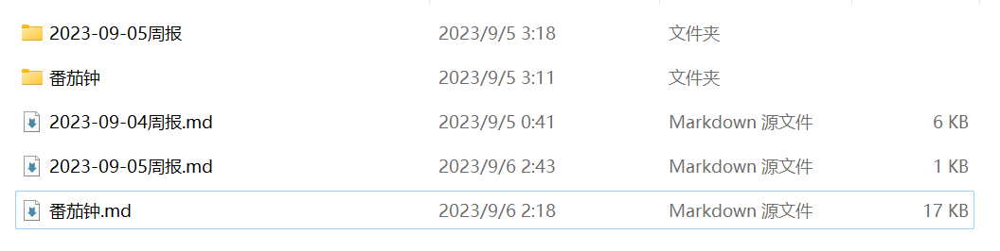
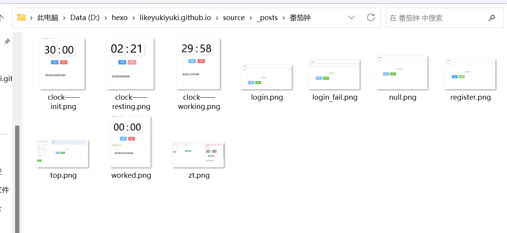
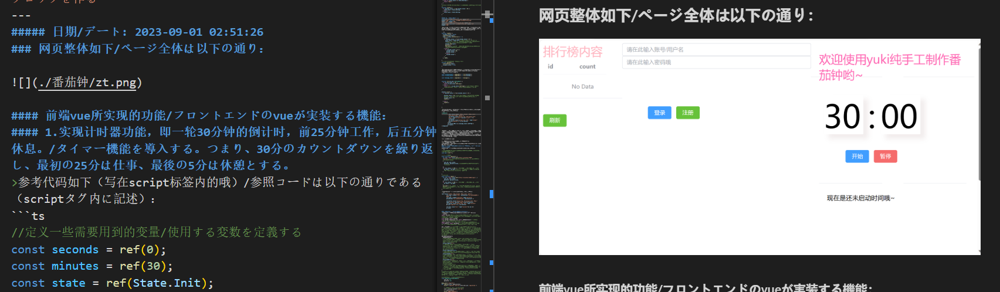
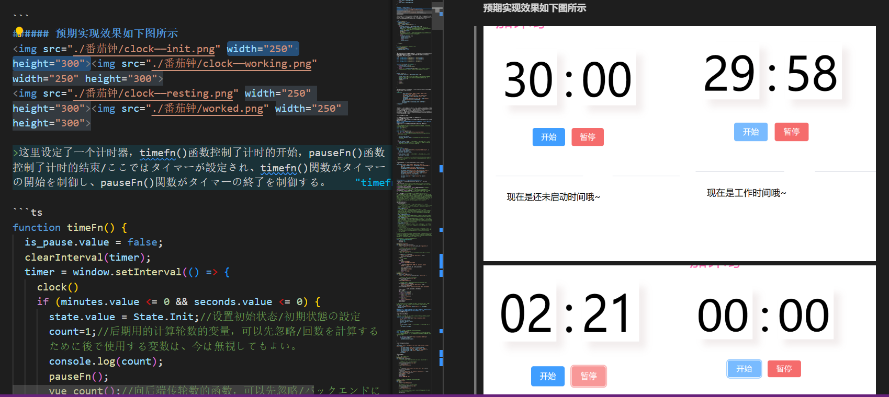
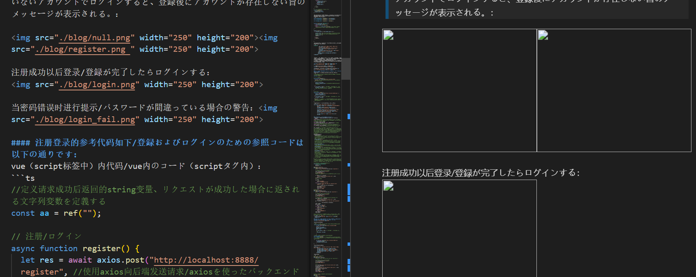

## 关于图片不能显示的问题：已解决
之前尝试安装hexo-render-marked插件时正好遇上“package.json文件内没有md文件转htm渲染器”的问题，于是耽搁了下来。当解决完上述问题时，再去安装插件就顺利很多了。
首先是键入命令:

`npm install hexo-renderer-marked `

安装成功后，在_config.yml中修改配置：

```
post_asset_folder: true //在创建一个新文章时自动创建同名文件夹，用于放图片
marked:
  prependRoot: true
  postAsset: true
```
然后在需要引用图片的博客内使用``
例如：我现在有一篇文章叫“番茄钟.md”，如图所示：

我需要在这篇文章内引用一张图片，那我就把图片放同名文件夹“番茄钟”内,如图所示：

接下来我只需要在“番茄钟.md”内写上相对路径即可，例如：``,效果如图：

如果需要设置图片的尺寸可以使用标签：``。
依旧用番茄钟举例子，如图所示：

记得绝对路径一定要写对，当对放图片的文件夹重命名以后，一定要把路径内名字改成新的，不然点击文章以后，hexo网页会变成404。一开始我还很疑惑为什么主页运行正常但是一点击文章就404了呢，后来发现是因为把放图片的文件夹改名后忘记在md文件内改过来了。

关于图片的问题到此就完美解决啦~

