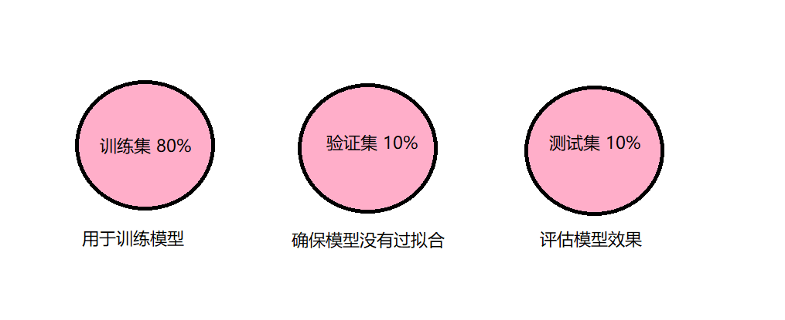
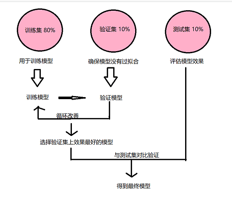
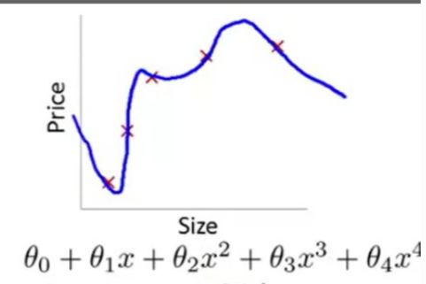

本周将学习基础的机器学习。

/ 今週は機械学習の基本を学びます。
## 首先是机器学习 / 1つ目は機械学習です
其实在上学期我已经进行了机器学习的一个简单学习，但是掌握的不是很好，知道一些名词概念但是整体框架完全不了解。机器学习的过程是什么样的？机器学习中的某个名词起到的是什么作用？统统不了解。在这周的学习中成功的把之前所学的概念连接起来了。

/ 実際、私は前学期に機械学習の簡単な学習を行いましたが、あまりうまく習得していません。私はいくつかの名詞の概念を知っていますが、全体的な枠組みをまったく理解していません。機械学習のプロセスはどのように見えますか? 機械学習における用語はどのような役割を果たしますか? 私はそれをすべて理解しているわけではありません。 今週の学習では、以前に学んだ概念をうまく結び付けることができました。
### 机器学习的过程 / 機械学習のプロセス
通过训练集，不断识别特征，不断建模，最后形成有效的模型，这个过程就叫做“机器学习”。

/ トレーニングセットを通じて、常に特徴を特定し、モデリングを続け、最終的に効果的なモデルを形成するこのプロセスは、「機械学習」と呼ばれます。
#### 监督学习与无监督学习 / 教師あり学習と教師なし学習
机器学习又分为监督学习和无监督学习，监督学习是需要我们自己输入标签的，而无监督学习则不需要。由于目前只学习了监督学习，所以接下来描述的内容基本上都是监督学习相关的。

/ 機械学習は教師あり学習と教師なし学習に分けられ、教師あり学習では自分でラベルを入力する必要がありますが、教師なし学習はそうではありません。 これまでは教師あり学習しか学習していなかったため、次に説明する内容は基本的に教師あり学習です。

没有免费午餐定理 / フリーランチ定理はありません
在机器学习中，有个定理被称为「没有免费的午餐」。简而言之，就是说没有一个算法可以完美解决所有问题，而且这对于监督学习（即对预测的建模）而言尤其如此。

/ 機械学習には「フリーランチがない」という定理があります。 要するに、単一のアルゴリズムがすべての問題を完全に解決できるわけではなく、これは教師あり学習、つまりモデリング予測に特に当てはまります。

#### 机器学习中的三大方向：分类、回归和聚类。 / 機械学習には、分類、回帰、クラスタリングという 3 つの主要な方向性があります。

回归方法：是一种对数值型连续随机变量进行预测和建模的监督学习算法。简单来说就是预测的结果是数值。

/ 回帰法:数値連続確率変数を予測してモデル化する教師あり学習アルゴリズムです。 簡単に言えば、予測結果は数値です

常用算法：
线性回归（正则化）、回归树（集成方法）、深度学习、最近邻算法等等

/ 一般的に使用されるアルゴリズム:
線形回帰 (正則化)、回帰木 (アンサンブル法)、ディープ ラーニング、最近傍アルゴリズムなど

分类方法：是一种对离散型随机变量建模或预测的监督学习算法。简单来说就是预测的结果是类别。

/ 分類法:離散確率変数をモデル化または予測する教師あり学習アルゴリズムです。 簡単に言えば、予測される結果はカテゴリです。

常用算法：
Logistic 回归（正则化）、分类树（集成方法）、深度学习、支持向量机（SVM）、朴素贝叶斯等等。

/ 一般的なアルゴリズム:
ロジスティック回帰(正則化)、分類木(アンサンブル法)、深層学習、サポートベクターマシン(SVM)、ナイーブベイズなど。

聚类是一种无监督学习，所以就不介绍了。

/ クラスタリングは教師なし学習の一形態であるため、だから私はそれを紹介しません。
#### 机器学习具体流程 / 機械学習の具体的なプロセス
机器学习首要的是数据，一般我们会把数据分为三个部分：训练集、验证集以及测试集。其中训练集占比最多大概在60%-80%，而验证集和测试集一般占比都在10%-20%。

/ 機械学習は何よりもまずデータであり、一般的にデータはトレーニングセット、検証セット、テストセットの3つの部分に分けられます。 その中で、トレーニングセットは最大で約60%〜80%を占め、検証セットとテストセットは通常10%〜20%を占めます。

作用如图所示 / 効果を図に示します：

分好数据以后，我们可以根据需求选择合适的模型进行训练，例如我想让机器分出猫狗，那么就可以选择Logistic回归方法来解决。训练好以后的模型利用测试集对自身进行评估并且不断调整超参数，直至选出在测试集上效果最好的模型，然后利用验证集进行评估模型最终的学习效果。

/データを分割した後、必要に応じてトレーニングに適したモデルを選択できます, たとえば、猫と犬を分離するためにマシンを使用する場合, ロジスティック回帰を選択して解決できます. トレーニング後、モデルは自己評価のためにテスト セットを使用し、テスト セットで最もパフォーマンスの高いモデルが選択されるまでハイパーパラメーターを継続的に調整し、検証セットを使用してモデルの最終的な学習効果を評価します。

如图所示 / 効果を図に示します：

#### 如何建模？ / モデル化するには?
训练模型表示通过有标签样本来学习（确定）所有权重和偏差的理想值。在监督式学习中，机器学习算法通过以下方式构建模型：检查多个样本并尝试找出可最大限度地减少损失的模型；这一过程称为经验风险最小化。

/ トレーニング済みモデルは、ラベル付きサンプルを持つことにより、すべての重みとバイアスを学習 (決定) するための理想的な値を表します。 教師あり学習では、機械学習アルゴリズムは、複数のサンプルを調べ、損失を最小限に抑えるモデルを見つけようとすることによってモデルを構築します。 このプロセスは、経験的リスク最小化と呼ばれます。

#### 如何评估模型好坏？ / モデルの品質を評価する方法は?
为了评估模型拟合的好坏，通常用损失函数来度量拟合的程度。损失函数极小化，意味着拟合程度最好，对应的模型参数即为最优参数。

/ モデルがどの程度適合しているかを評価するために、通常、適合度は損失関数によって測定されます。 損失関数は最小化され、適合が最良であり、対応するモデルパラメータが最適なパラメータであることを意味します。
##### 损失函数（loss function） / 損失関数（loss function）
损失函数就是用来度量模型的预测值f(x)与真实值Y的差异程度的运算函数。

/ 損失関数は、モデルの予測値f(x)と真の値Yとの差の度合いを測定する演算関数です。

##### 过拟合（Over fitting）/ オーバーフィッティング（Over fitting）
有时损失函数很小但最终的训练效果却并不好，因为模型太复杂，它过度学习历史数据，因此学习到的无关特征太多，这种情况称为过拟合。

/ 損失関数は小さいが、最終的なトレーニング効果は良くない、モデルが複雑すぎるため、履歴データを過剰に学習し、無関係な特徴を学習しすぎてオーバーフィットと呼ばれることがあります。

如图所示 / 効果を図に示します：

> 图源吴恩达机器学习 / 出典:Andrew Ng 機械学習

##### 正则化（Regularization） / 本格化（Regularization）
为了防止机器学习中发生过拟合，需要在损失函数中加入正则项，这种情况称之为正则化。它对系数进行惩罚，通过向模型添加额外参数来防止模型过度拟合，这有助于提高模型的可靠性、速度和准确性。

/ 機械学習におけるオーバーフィッティングを防ぐためには、正則化と呼ばれる状況である損失関数に正則項を追加する必要があります。 係数にペナルティを課し、モデルにパラメーターを追加することでモデルのオーバーフィットを防ぎ、モデルの信頼性、速度、精度の向上に役立ちます。

关于机器学习的基础理论部分就到此为止啦，之后会慢慢更具体的算法内容。

/ これで機械学習に関する基本的な理論的部分は終わり、その後、より具体的なアルゴリズムの内容が徐々に続きます。