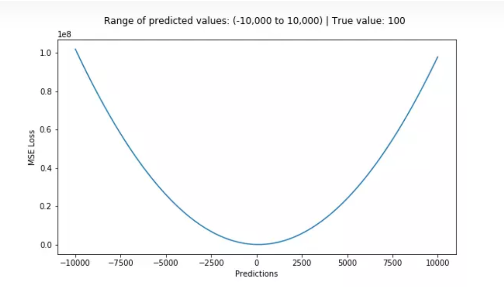
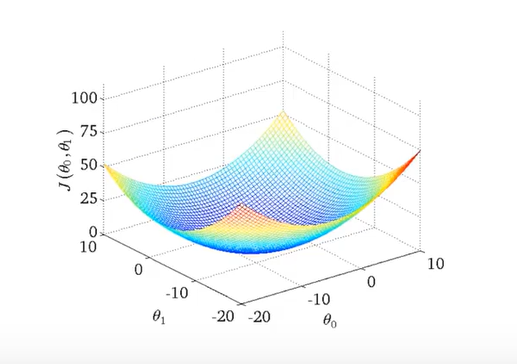
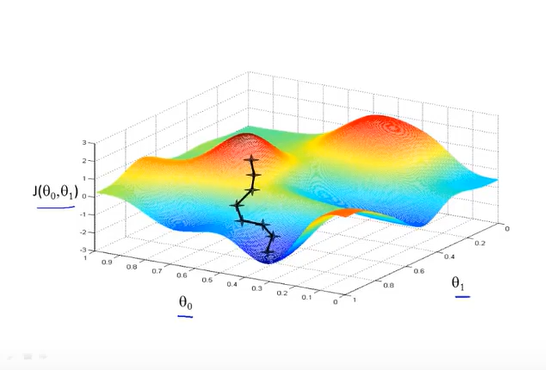
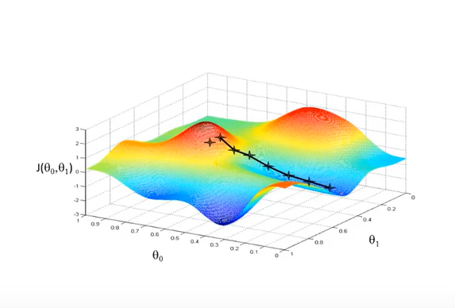
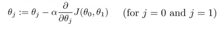
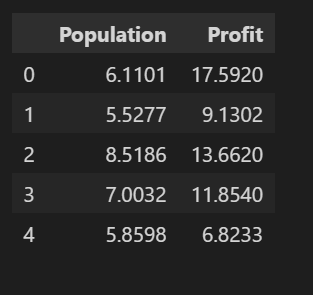
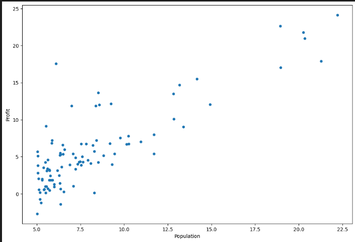
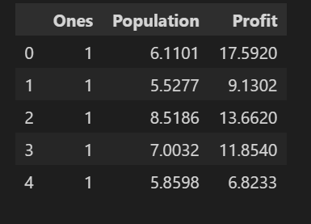
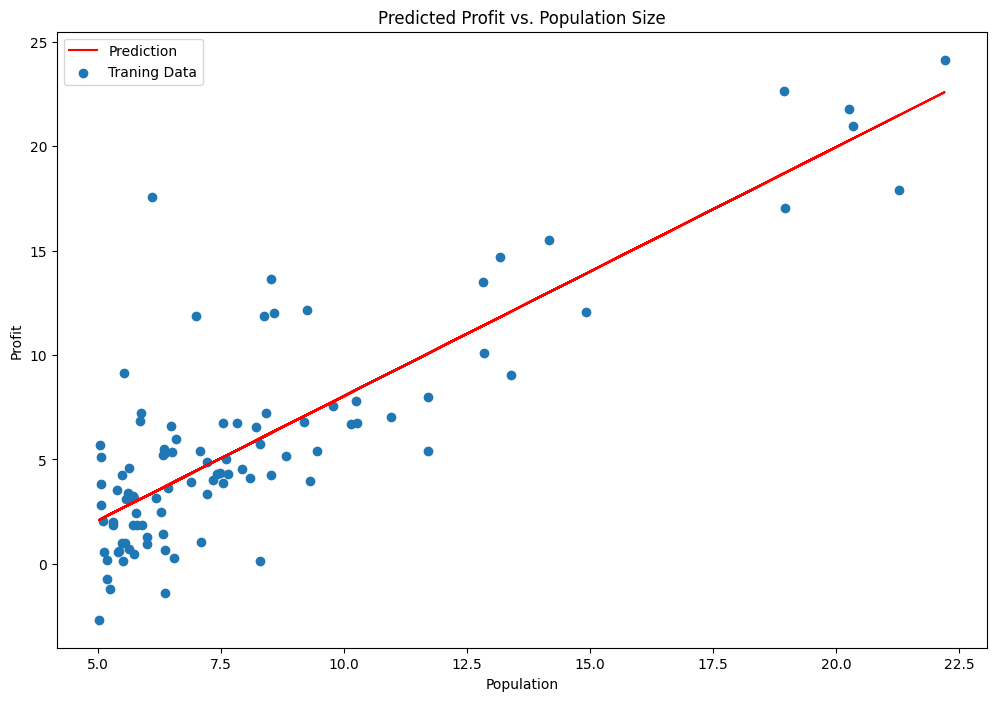

本周由于前四天时间都花费在往返学校以及考试中，所以学习的内容比较少，这周是关于线性回归的梯度下降算法的学习。

/今週は、最初の4日間が学校への往復と試験を受けていたため、勉強量は少なかった。今週は、線形回帰の勾配降下アルゴリズムについてだった。

# 理论部分 线性回归(Linear Regression) / 理論的な部分 線形回帰 (Linear Regression) 
线性回归是一个监督学习的算法，基于上周学习的基础可以知道，回归问题是需要得到一个具体的预测值的，而线性回归顾名思义，其函数图像是一个线性图像。训练集中有着大量数据以及其映射关系，而机器学习的目的就是得到这种映射关系。这么说起来感觉很抽象，就像一个普通的二元一次方程，当我们知道一个x和方程式那必然可以得到一个y，机器学习就是已知有许多个x与y，需要找到方程式（也就是映射关系）。用专业点的话来说就是建立了一个模型。

/ 線形回帰は、教師あり学習アルゴリズムであり、先週の学習に基づいて、回帰の問題は、線形問題は具体的な予測値を得ることになることが知られていることができ、線形回帰の名前が示すように、その関数のイメージは、線形画像です。学習セットには大量のデータとその対応関係があり、機械学習の目的はこの対応関係を得ることである。そう言うのは抽象的な感じがする、普通の2次方程式のように、xと方程式がわかれば必然的にyが求まる。機械学習とは、多くのxとyが存在し、その方程式（別名マッピング関係）を見つける必要があることを意味する。専門的な言い方をすれば、モデルは作られる。
## 代价函数 (Cost Funcation) / コスト関数 (Cost Funcation)
如何评价一个模型的好坏呢？这就需要引出接下来的代价函数了。当我们已经找到一个方程式，这时候我们可以对已经找到的方程输入一个x值而得到的一个y值（预测值），而同时我们又知道原本的y值（真实值），而真实值与预测值之间的差值（残差）就可以评估这个模型的好坏。但是问题是仅仅一个参数肯定没有代表性，那么我们需要对所有的进行计算然后求平方（为了消除负值）最后相加，我们就得到了预测值与真实值的方差（即代价函数cost function）用以评估模型。而我们此时的目的就转化成了找到cost function的最小值。

/ モデルの良さをどう評価するか？ これが次のコスト関数につながる。 方程式が見つかったとき、方程式にx値を入力してy値（予測値）を得ることができ、同時に元のy値（真値）を知ることができ、真値と予測値の差（残差）を使ってモデルの良し悪しを評価することができる。 しかし問題は、1つのパラメータだけでは代表性がないことです。そのため、すべてのパラメータを計算し、（負の値を排除するために）それらを2乗し、最後にそれらを合計して、予測値と真の値の分散（コスト関数 cost function）を求め、モデルを評価する必要があります。 この時点での我々の目標は、cost functionの最小値を見つけることです。
公式如图所示 / 計算式を図に示す：

当模型仅有一个参数时，函数的图像如图所示 / モデルのパラメータが1つだけの場合、関数のイメージは図に示すようになる：

当模型有两个参数时，函数图像如下 / モデルが2つのパラメータを持つ場合、関数イメージは次のようになる：

## 梯度下降法（Gradient Descent） / 勾配降下法（Gradient Descent）
上面说到我们现在的目的是找到cost function的最小值，那么有什么方法可以准确快速的找到一个函数的最小值呢？没错，就是梯度下降法。它的工作原理是从初始点开始，不断寻找一个最优方向进行下降，直至收敛至局部最低点。而方向即是导数的方向。
/ 今の目標は、コスト関数の最小値を見つけることだ、では、関数の最小値を正確かつ迅速に求める最良の方法は何か？ そう、勾配降下法だ。 勾配降下法とは、初期点から最適な降下方向を常に探しながら、局所最小値に収束するまで働き続ける方法である。 その方向とは微分の方向である。
如图所示 / ご覧の通りだ：

如果初始位置不同找到的最低点也有可能不同。/初期位置が異なれば、見つかる最低点は異なるかもしれない。

而如果当初始点就是在局部最低点的时候，将不会继续下降了。/また、最初のスタート地点が局所的な最小値であれば、下がり続けることはない。
梯度下降法的公式如图所示 /勾配降下法の計算式を図に示す：

":="此符号的意思是赋值，意味着梯度下降是一个不断迭代的过程。
其中的"α"是决定下降的速率：α过小时，学习速率很低；α过大时，容易找不到局部最低点。
/ 記号":="は代入を意味し、勾配降下が反復プロセスであることを意味する。
α "は降下率を決定する。αが小さすぎると学習率が非常に低くなり、大きすぎるとローカル・ミニマムを見つけられなくなる。
## 线性回归的梯度下降法 / 線形回帰の勾配降下法
最巧妙的地方就是在这里，前面说到了梯度下降法有一个问题在于它只能找到局部最优解而不是全局最优解，但是线性回归中代价函数的图像是一个凸函数，即只有一个最优解。那么在线性回归中运用梯度下降法简直是天作之合。

/ 勾配降下法には大域的な最適解ではなく局所的な最適解しか見つけられないという問題があるが、コスト関数の画像における線形回帰は凸関数であるため、最適解は1つしかない。 線形回帰における勾配降下法の使用は、まさに相性が良いのである。

那么关于线性回归的梯度下降算法的理论部分就到这里为止啦~
/線形回帰の勾配降下アルゴリズムの理論的な部分はこれで終わりです。
# 实验 线性回归算法相关demo的运行 / 実験 線形回帰アルゴリズムに関するdemoの実行
首先就是导入相关包，一般demo的开头代码如下 / まず最初に、関連するパッケージをインポートする。典型的なdemoの冒頭のコードは以下の通りである：
```py
import numpy as np
import pandas as pd
import matplotlib.pyplot as plt
```
如果没有安装相关包在终端使用`pip install [包名]`即可，例如我需要安装numpy，则使用`pip install numpy`。以此类推，将我们需要的包安装好。

/ 関連パッケージがインストールされていない場合は、ターミナルで `pip install [パッケージ名]` を使用する。例えば、numpyをインストールする必要がある場合は、`pip install numpy` を使用する。 というように、必要なパッケージをインストールしていく。

接下来就是读取数据，我们可以直接调用pandas库内的read_csv()函数来读取，其中参数path为文件路径，header与names都可以充当列名，当names没被赋值时，header会变成0，即选取数据文件的第一行作为列名；当 names 被赋值，header 没被赋值时，那么header会变成None。如果都赋值，就会实现两个参数的组合功能。head()方法默认输出数据的前5项，这里用来查看文件是否导入成功：

/次のステップは、データを読み込むことである。読み込みには、read_csv（）関数内でpandasライブラリを直接呼び出すことができる、pathはファイルパス。headerとnamesの両方を列名として使用することができる。 namesを割り当てない場合、headerは0になり、つまりデータファイルの最初の行が列名として選択される；namesが代入され、headerが代入されていない場合、headerはNoneになり、両方が代入されている場合、2つのパラメータの組み合わせが実現される。head()メソッドは、データの最初の5項目を出力するのがデフォルトであり、これはファイルが正常にインポートされたかどうかをチェックするために使用される：
```py
path = 'ex1data1.txt' #路径 / path
data = pd.read_csv(path, header=None, names=['Population', 'Profit']) #读取数据的方法 / データ読み取り方法
data.head() 
```



然后是画图，plot()显而易见的是一种绘图函数，参数`kind='scatter'`图像类型为散点图，`x='Population', y='Profit'`定义x轴为'Population'、y轴为'Profit'，`figsize=(12,8)`图片尺寸大小(width=12,height=8)

/ それからドローイングだ。plot() は明らかにプロット関数で、パラメータ `kind='scatter'` 画像タイプは散布図、`x='Population', y='Profit'` は x 軸を 'Population', y 軸を 'Profit' と定義し、`fitsize=(12,8)` 画像サイズ (width=12,height=8) を指定します
```py
data.plot(kind='scatter', x='Population', y='Profit', figsize=(12,8))
plt.show()
```

再往dataframe添加一列数据，使用函数insert()，其中参数'0'代表添加至第一列，'Ones'代表列名为'Ones'，'1'代表插入数字'1'

/ dataframeに別の列のデータを追加する、nsert()関数を使用する。パラメータ'0'は最初のカラムへの追加を表し、'Ones'はカラム名'Ones'を表し、'1'は数値'1'の挿入を表す。
```py
data.insert(0, 'Ones', 1)
data.head()
```



```py
cols = data.shape[1] #获取列数 /列数の取得
X = data.iloc[:, 0:cols-1] #得到dataframe中所有行，1列到cols-1列的数据，即第一列至第二列的数据 /dataframe内の全行、1列目からcols-1まで、つまりデータの1列目から2列目までを取得する。
Y = data.iloc[:, cols-1:cols]#得到dataframe中所有行，cols-1列到cols列的数据，即第二列至第三列的数据 /dataframe内のすべての行、cols-1 から cols、つまりデータの2列目から3列目を取得する
X = np.matrix(X.values) 
Y = np.matrix(Y.values)#转化为矩阵 /行列への変換
theta = np.matrix(np.array([0, 0])) #theta为[0,0]的矩阵 /thetaは[0,0]の行列である
```
导入包，选择LinearRegression模型，使用fit()函数利用选好的模型训练数据，参数中X代表输入，Y代表输出。

/パッケージをインポートし、LinearRegressionモデルを選択し、fit()関数を使用して、選択したモデルを使用してデータを訓練する。Xは入力、Yは出力を表す。
```py
from sklearn import linear_model
model = linear_model.LinearRegression()
model.fit(np.array(X), np.array(Y))
```
开始绘制图像：
/ 画像を描き始める：
```py
x = np.array(X[:, 1].A1) #得到所有x的值的数组 /すべてのx値の配列を取得する
y = model.predict(np.array(X)).flatten() #得到预测值y，并且降维成一维数组 /予測値yを取得して一次元配列に次元削減
fig, ax = plt.subplots(figsize=(12,8)) #画图、定义子图大小 /ダイアグラムの描画、サブダイアグラムのサイズの定義
ax.plot(x, y, 'r', label='Prediction')#在活跃区域绘图，坐标xy，颜色'r'即红色，标签label为'Prediction' /アクティブエリアにプロット、座標はxy、色は'r'すなわち赤、ラベルは'Prediction'。
ax.scatter(data.Population, data.Profit, label='Traning Data')#x轴数据为data.Population，y轴数据为data.Profit，标签label为'Traning Data' /x軸のデータはdata.Population、y軸のデータはdata.Profit、ラベルのラベルは'Traning Data'である。
ax.legend(loc=2)#图例位置为左上角 /レジェンドの位置は左上
ax.set_xlabel('Population')#x轴标签为'Population' /X軸のラベルは'Population'
ax.set_ylabel('Profit')#y轴标签为'Profit' /Y軸のラベルは'Profit'
ax.set_title('Predicted Profit vs. Population Size') #图片title /画像タイトル
plt.show()#展示图片 /写真を見る
```

