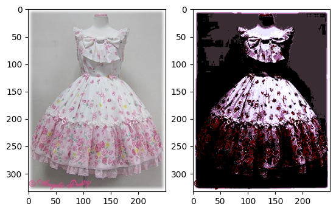
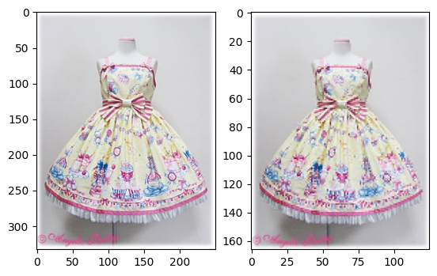
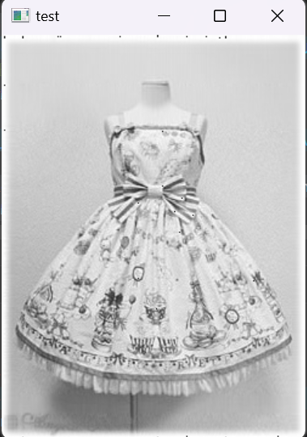

本周的主要学习任务是准备数据集、寻找方法对图像进行压缩降维等。首先是数据集的准备，目前就准备了两个类别--jsk（jumper skirt）和op（one piece）。这里需要说明一下，jsk是指无袖连衣裙，而op则相反，是指有袖连衣裙。每个类别里都放了差不多150张图片。

/今週の主な学習課題は、データセットの準備、画像を圧縮する方法の発見、次元の削減です。 1つ目はデータセットの準備で、現在はJSK(jumper skirt)とOP(one piece)の2つのカテゴリがあります。 ここで明確にする必要があるのは、JSKはノースリーブのドレスを指し、OPは逆に袖のあるドレスを指すということです。 各カテゴリには約150枚の画像があります

## 使用k-means算法降低分辨率
之前学习过的k-means算法可以用于降低分辨率，因此我尝试使用k-means算法进行图像处理。接下来结合代码讲解我的思路：

/以前学習したk-meansアルゴリズムは解像度を下げるのに使えるので、画像処理にk-meansアルゴリズムを使ってみました。 私の考えをコードと組み合わせて説明しましょう。

构造一个函数，传入的参数data即我们要进行处理的图像，返回值image则是已经进行过处理的图像。

/入力パラメーター data が処理する画像であり、戻り値 image が処理された画像である関数を構築します
```py
def kmeans_scikit(data):
    pic=data
    data=data.convert("RGB")
    # 将图像转换为NumPy数组/画像を NumPy 配列に変換する
    image_array = np.array(data)
    
    # 正则化处理/本格化
    normalized_image = (image_array - np.mean(image_array)) / np.std(image_array)
    
    
    data = np.reshape(normalized_image,(250*333, 3))
    data.shape
    #导入k-means库 /k-meansライブラリのインポート
    from sklearn.cluster import KMeans
    # 构建kmeans算法模型 /kmeansアルゴリズムのモデル化
    model = KMeans(n_clusters=13, n_init=2000)
    # 开始训练 /トレーニング開始
    model.fit(data)
    centroids = model.cluster_centers_  
    print(centroids.shape)              # 查看簇的形状 \クラスターの形状を見る
    C = model.predict(data)             # 获取每条数据所属簇 \各データが属するクラスタを取得する
    C.shape

    centroids[C].shape  
    compressed_pic = centroids[C].reshape((333,250,3))
    # 绘制原图和压缩图片 /オリジナル画像と圧縮画像の描画
    fig, ax = plt.subplots(1, 2)
    ax[0].imshow(pic)
    image = ax[1].imshow(compressed_pic)
    return image
```


## 平均池化法
平均池化（Average Pooling）是一种常用的下采样操作，通常用于卷积神经网络（CNN）中。它可以将输入特征图的空间尺寸减小，并保留主要特征。

/平均プーリングは、畳み込みニューラルネットワーク(CNN)で一般的に使用されるダウンサンプリング操作です。 これにより、入力特徴マップの空間サイズが縮小され、主要な特徴が維持されます。

于是我又试着用平均池化法进行处理：
/そこで、平均的なプーリング方法を使用して対処しようとしました。
```py
def downsample_image(image, scale_factor):
    # 获取原始图像的尺寸 /元の画像のサイズを取得する
    
    image = np.array(image)
    height, width = image.shape[:2]
    
    # 计算降低分辨率后的新尺寸 /解像度を下げた後の新しい寸法を計算する
    new_height = int(height / scale_factor)
    new_width = int(width / scale_factor)
    
    # 使用最近邻插值方法进行图像缩放 /画像のスケーリングは、最近傍内挿法を使用して実行されます
    resized_image = cv2.resize(image, (new_width, new_height), interpolation=cv2.INTER_NEAREST)
    
    return resized_image

# 读取原始图像 /元の画像を読み取る
data = image_array[0]
# 设置缩放因子 /スケール係数の設定
scale_factor = 2
```


## PCA（Principal Component Analysis，主成分分析）
PCA是一种常用的降维算法，用于将高维数据转换为低维表示，同时保留数据中最重要的信息。PCA的基本思想是通过线性变换将原始数据投影到一个新的坐标系中，使得投影后的数据具有最大的方差。这个新的坐标系由一组相互正交的主成分构成，主成分是原始数据经过特征值分解得到的线性组合。

/PCA は、データ内の最も重要な情報を保持しながら、高次元データを低次元の表現に変換するために一般的に使用される次元削減アルゴリズムです。 PCA の基本的な考え方は、元のデータを線形変換によって新しい座標系に投影し、投影されたデータの分散が最大になるようにすることです。 この新しい座標系は、互いに直交する一連の主成分で構成され、主成分は固有値によって分解された元のデータの線形結合です。
```py
#协方差矩阵 /共分散行列
def Cov(dataMat):
	meanVal = np.mean(data,0) #压缩行，返回1*cols矩阵，对各列求均值 /行を圧縮し、1*cols 行列を返し、列を平均化します
	meanVal = np.tile(meanVal, (rows,1)) #返回rows行的均值矩阵 /rowsの平均行列を返します。
	Z = dataMat - meanVal
	Zcov = (1/(rows-1))*Z.T * Z
	return Zcov

#数据中心化 /データ・センタライゼーション
def Z_centered(dataMat):
	rows,cols=dataMat.shape
	meanVal = np.mean(dataMat, axis=0)  # 按列求均值，即求各个特征的均值 /列ごとの平均を求める、つまり、各特徴量の平均を求める
	meanVal = np.tile(meanVal,(rows,1))
	newdata = dataMat-meanVal
	return newdata, meanVal

#最小化降维造成的损失，确定k /次元削減による損失を最小化し、k 値を決定する
def Percentage2n(eigVals, percentage):
	sortArray = np.sort(eigVals)  # 升序 /昇順
	sortArray = sortArray[-1::-1]  # 逆转，即降序 /反転、つまり下行
	arraySum = sum(sortArray)
	tmpSum = 0
	num = 0
	for i in sortArray:
		tmpSum += i
		num += 1
		if tmpSum >= arraySum * percentage:
			return num

#得到最大的k个特征值和特征向量 /最大k個の固有値と固有ベクトルが取得されます
def EigDV(covMat, p):
	D, V = np.linalg.eig(covMat) # 得到特征值和特征向量 /固有値と固有ベクトルが得られます
	k = Percentage2n(D, p) # 确定k值 /k 値の決定
	print("保留99%信息，降维后的特征个数："+str(k)+"\n")
	eigenvalue = np.argsort(D)
	K_eigenValue = eigenvalue[-1:-(k+1):-1]
	K_eigenVector = V[:,K_eigenValue]
	return K_eigenValue, K_eigenVector

#得到降维后的数据 /次元削減後のデータが得られます
def getlowDataMat(DataMat, K_eigenVector):
	return DataMat * K_eigenVector
 
#重构数据 /データのリファクタリング
def Reconstruction(lowDataMat, K_eigenVector, meanVal):
	reconDataMat = lowDataMat * K_eigenVector.T + meanVal
	return reconDataMat

#PCA算法 /PCA アルゴリズム
def PCA(data, p):
	dataMat = np.float32(np.mat(data))
	#数据中心化 /データ・センタライゼーション
	dataMat, meanVal = Z_centered(dataMat)
	#计算协方差矩阵 /共分散行列を計算する
		#covMat = Cov(dataMat)
	covMat = np.cov(dataMat, rowvar=0)
	#得到最大的k个特征值和特征向量 /最大k個の固有値と固有ベクトルが取得されます
	D, V = EigDV(covMat, p)
	#得到降维后的数据 /次元削減後のデータが得られます
	lowDataMat = getlowDataMat(dataMat, V)
	#重构数据 /データのリファクタリング
	reconDataMat = Reconstruction(lowDataMat, V, meanVal)
	return reconDataMat
```

PCA进行了很好的降维，我们保留了99%的主要特征，将特征维数从一开始的250个降到了100个。
/PCA は次元削減に成功し、主要な特徴の 99% を保持し、最初に特徴の次元数を 250 から 100 に減らしました。

一些进行降维的方法就介绍到这里了，接下来也会继续学习对图像特征进行提取和优化的方法。
/ここでは次元削減の手法をいくつか紹介してきましたが、今後も画像の特徴を抽出して最適化する方法について学習していきます。