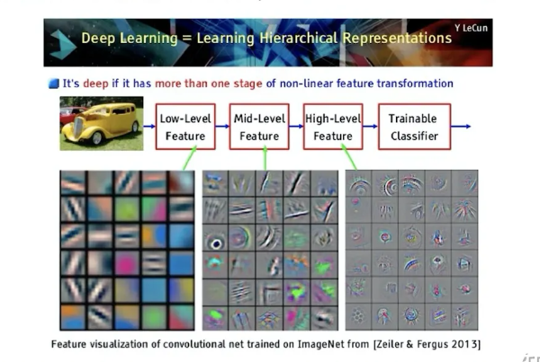
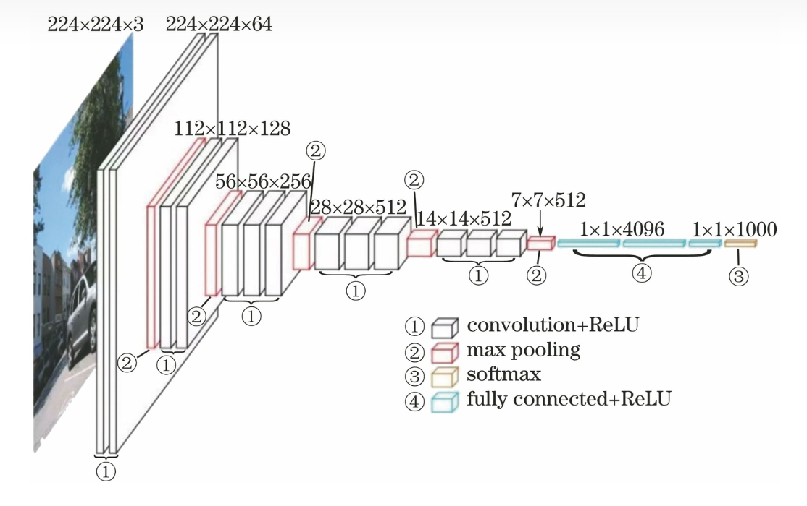
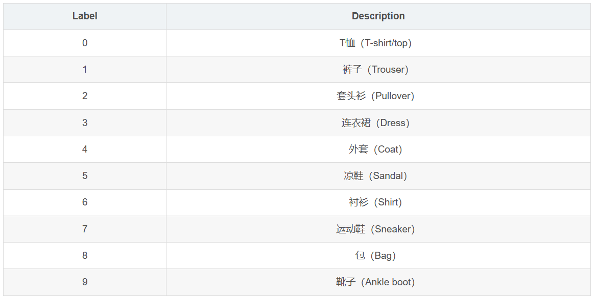

上周去考试了于是断更了一周QAQ，这周的学习内容是关于服装分类的论文解读[基于层次卷积神经网络的时尚图像分类](https://www.sciencedirect.com/science/article/abs/pii/S0957417418305992/)，由于该论文较长，所以接下来会分部分解读。
### 摘要部分
深度学习对各行各业的处理应用都有帮助，而本篇论文主要介绍的是在时装领域的应用。在时装领域的应用有很多，但是在这些应用中最主要的技术是图像分类，但是服装的属性很多，也有非常多相似的服装但却不是同一类，比如说卫衣和衬衫以及外套，款式和材质都不同不能分为一类，但是都是上衣，并且有些时尚单品会融合元素，例如卫衣外套。因此区分相似服装很困难。而这里作者提出对服装图像进行一个层次分类。
#### 层次结构
什么是层次呢？一个复杂图像往往由固定的简单像素点组成，而我们在提取特征的时候，第一层是基础像素点，第二层细化一下，可能是某些固定像素点的组合，再一层层的提取，最后就能得到一个可以精确的特征。

在之前的大多数研究中，使用CNN进行图像分类时并没有考虑到层次结构，甚至使用其他方法进行图像分类时也没有考虑层次结构。因此该论文首次提出将层次卷积神经网络（H-CNN）应用于服装分类，并且提出的模型是一个输出城信息的知识嵌入型分类器，该论文使用VGGNet在Fashion-MNIST数据集上实现H-CNN。
#### CNN
CNN的全称是"Convolutional Neural Network"(卷积神经网络)。而神经网络是一种模仿生物神经网络（动物的中枢神经系统，特别是大脑）结构和功能的数学模型或计算模型。
CNN对于图像识别的过程就像人类对于图像识别的过程一样，假如我们看到一张小狗的图片，我们看到小狗的耳朵、眼睛、鼻子、尾巴、以及四肢和毛发这些特征组合在一起就可以判断这是一只小狗。但是如果是这些特征有细微的变化，比如有胡须、尾巴长长的、四肢更纤细那么我们就可以识别出猫咪。而CNN也是根据图像特征的组合来识别图像的内容的，下面来简单说说CNN的组成：
1. 卷积层 用于提取特征
2. 池化层 用于减少无关参数，精确特征
3. 全连接层 用于进行分类

如果我们进行一个猫狗的图片分类，那么卷积层就是用于提取猫狗的特征。在卷积层提取到特征以后也可能会提取到一些无关特征，也可能提取到的特征太大而不方便用于识别。池化层保留主要的特征，压缩了特征的大小，对于后续的识别非常有帮助。最后是全连接层，我们最终需要的是猫和狗两个分类，那么全连接层的作用就是将我们之前处理好的特征进行分类，最后就可以的得出分类好的猫狗图片了。
#### VGGNet
VGGNet是在2014年，由牛津大学计算机视觉组（Visual Geometry Group）和Google DeepMind公司一起研发了新的卷积神经网络。VGGNet是比AlexNet更深的深度卷积神经网络，该模型获得了2014年ILSVRC竞赛的第二名。VGG由5层卷积层、3层全连接层、1层softmax输出层构成，层与层之间使用maxpool（最大化池）分开，所有隐藏层的激活单元都采用ReLU函数。

#### Fashion MNIST                                                                                             
Fashion MNIST服饰数据集包含70000张灰度图像，其中包含60,000个示例的训练集和10,000个示例的测试集，每个示例都是一个28x28灰度图像，分为以下几类：

结果表明，使用H-CNN模型时，与没有层次结构的基本模型相比，损失减少，精度提高。因此得出结论，H-CNN在服装分类中具有更好的性能。

