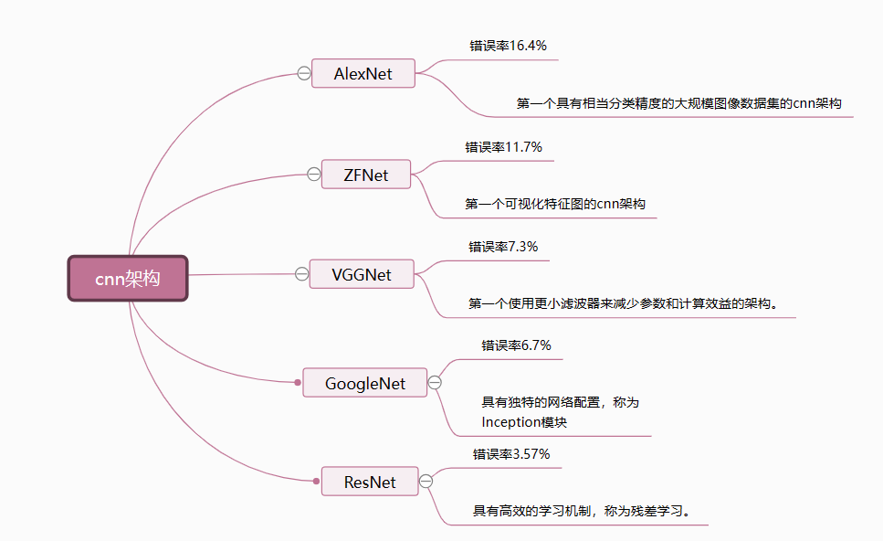
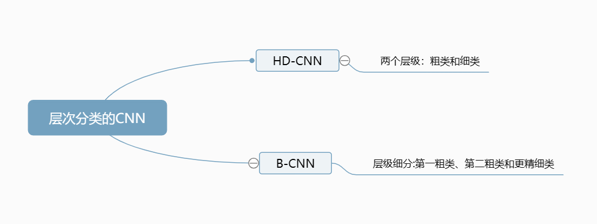

这周继续对论文进行解读。
### 相关工作
#### 2.1 卷积神经网络cnn
一些cnn架构的介绍：
1. AlexNet。AlexNet于2012年提交给ILSVRC挑战赛，它对包含1500万张图像和2.2万个类别的ImageNet数据进行了分类，并实现了前5名的测试错误率16.4%。
2. ZFNet。ZFNet凭借11.7%的错误率提高了AlexNet的性能，赢得了比赛的冠军。
3. VGGNet。VGGNet在ILSVRC 2014中提交，其更高的性能为7.3%的错误率和包含16个卷积和全连接层的更深层
4. GoogLeNet。其错误率达到了6.7%。该网络的不同之处在于，它是第一个引入并行层结构的网络，即Inception模块。
5. ResNet。错误率为3.57%，并且基于残差学习不会出现退化问题。

这些架构相互结合产生了一种混合方法，即基于残差学习训练的Inception模块引入了Inception- resnet。
迁移学习也是一种广泛应用于机器学习和深度学习的学习方法。将先例问题中的一种知识应用于另一个相关问题。当应用于CNN时，预训练网络可以从大规模的通用数据集中提取学习到的特征，然后将这些特征输入到具有较小指定数据集的微调网络中。也可以用于非手工特征提取的深度迁移学习方法，首先将cnn作为通用特征提取器，然后用这些特征来训练SVM。
#### 2.2 服装的分类
图像分类可以更快、更有效的管理购物网站的产品，图像分类可以通过品牌、款式、类型等等对产品进行过滤和搜索。也可以标记产品描述和推荐类似用户可能感兴趣的商品。图像分类在时尚领域有很多应用，也会带来许多好处。
较早的研究中对服装分类和检索进行了改进，使用的街头的日常照片和背景干净的专业商业服装图片。在这项研究中使用了人体检测器来检测30个人体部位来减少人体姿势不同所带来的差异。也采用了辅助集防止背景的干扰，例如当两个完全不一样的衣服背景相同时就容易被判定为同样的。通过定向梯度直方图(HOG)和局部二值模式(LBP)、颜色矩、颜色直方图和皮肤检测器提取特征（获取到纹理、轮廓、色彩、皮肤辨别组合在一起），并将特征拼接在一起表示人体部位。但是这种方法提取性能较低，对于大规模或者复杂图像的提取可能不完整。

在最近的研究中，cnn被应用于图像分类。在先对服装类型分类再通过查询图像检索并且推荐相似的服装的研究中，这里的分类使用的就是cnn。在cnn架构中，使用了GoogLeNet，并在ImageNet数据集上进行了预训练。去除最后一层的结构，用新层进行训练，对服装数据集进行分类。分类处理后使用[KNN](./KNN算法.md)进行检索，计算查询图像与预测类样本图像的相似度，最后选择差距最小的图像作为相似服装。

服装的细粒度类别反映在分类过程中，在服装分类系统中，有t恤、裙子、鞋子等细粒度高的分类，也有高跟鞋、中跟鞋等细粒度低的分类。将鞋类细分为107个子类，使用预训练的模型来获取大致的图像特征，从而获得更好更快的预测结果。这也解决了小数据集的限制，因为从外部的数据集中就可以获取到许多需要的特征。也有一种模型叠加的方法，称为双流模型。在第一个流程中将图像的向量特征简化为低维特征，在第二个流程中完成预训练。双流模型显著提高了分类精度。由于该论文中的细粒度分类器的类数和预训练的计算成本扩大了分类范围，因此还需要进一步层次分类，也就是先进行粗分类再进入特定类别。
#### 2.3层次分类
在首次采用深度学习对图形进行分类的尝试中，将DNN训练为n-way分类器，并且认为类与类之间是平等的。但是一些类好区分，例如苹果和公共汽车，而另外一些类是难以区分的，例如苹果和橘子。橘子和苹果都属于”水果“这一粗类别，而公交车则属于”车辆“这一粗类别。提出的模型层次深度卷积神经网络（HD-CNN）中，就是先用初始粗分类器CNN来分类那些易于区分的类，即粗类。再划分为细类。在HD-CNN中的训练过程中，先进行预训练，然后通过正则化粗类别的损失函数以优化全局。该研究中建立三种不同的HD-CNN以进行对比它们在不同层组合下的性能。HD-CNN第一次将层次结构和CNN结合在一起，通过利用CNN分类，再关注粗类，在关注同一粗类下的细类，取得了更好的效果。而不需要增加训练的复杂度。HD-CNN的局限性在于需要两步的训练，第一步是粗类和细类的预训练，第二步是微调过程。此外，HD-CNN不能用于多层(两层以上)层级分类的情况，因为它只有粗类和细类两层。

因此在后来的研究中引入了分支卷积神经网络（B-CNN）。B-CNN的概念来源于CNN的低层捕获图像的低层特征，而高层提取图像的高层特征。随着B-CNN的层次，它将输出从粗到细的排序预测，与目标类别的层次结构对应。而对于B-CNN的训练提出了分支训练策略(Branch training strategy，简称BTstrategy)。它可以调整输出层上的参数，减少损失。B-CNN的结果和训练过程使输入随着层块学习从粗到细的概念。其好处在于它比平面的CNN更有信息量，并且可以将误差限制在在第一粗类、第二粗类或精细类的子类别中。B-CNN提供了一个很好的指南，并且比CNN的预测更具有可解释性。

另外的研究中提出了使用cnn实现层次分类，它存在着第一粗层次和第二细层次。但是两个不同的分类器需要单独训练，因此训练阶段多，分类层次数量有限的问题存在。在后来的研究中这些问题可以通过bt策略训练每个层级结构的单个过程，并且将多个层级的类别分为第一粗类、第二粗类和最后精细层级来解决。也就是将每个层次再细分为层次，这样就可以解决普通cnn只有两层的局限性了。