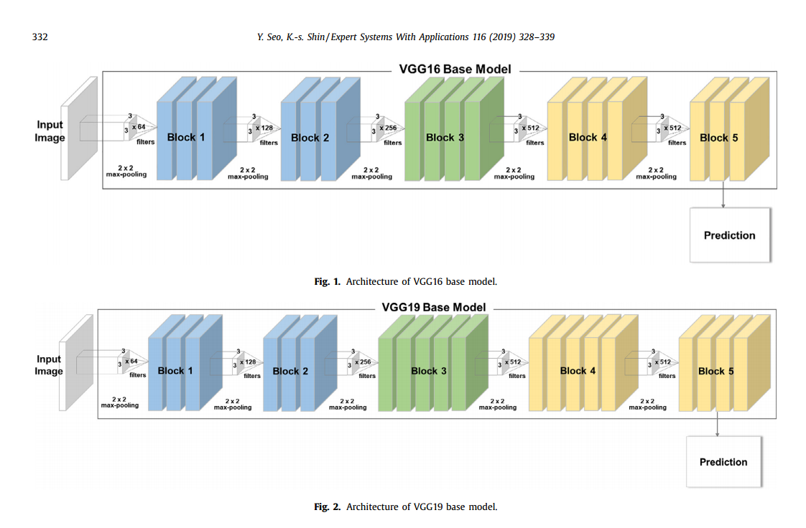
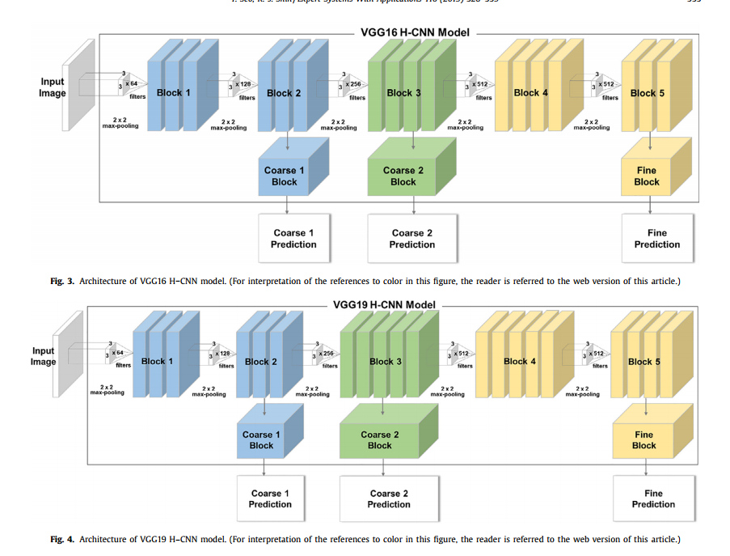
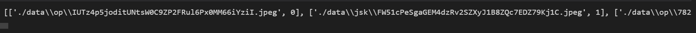
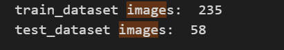
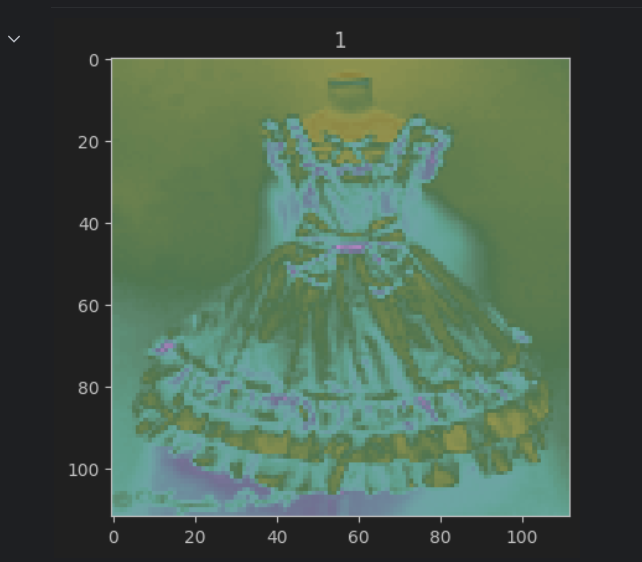
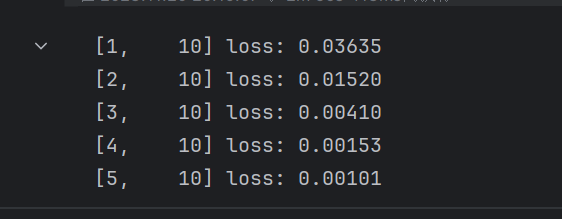
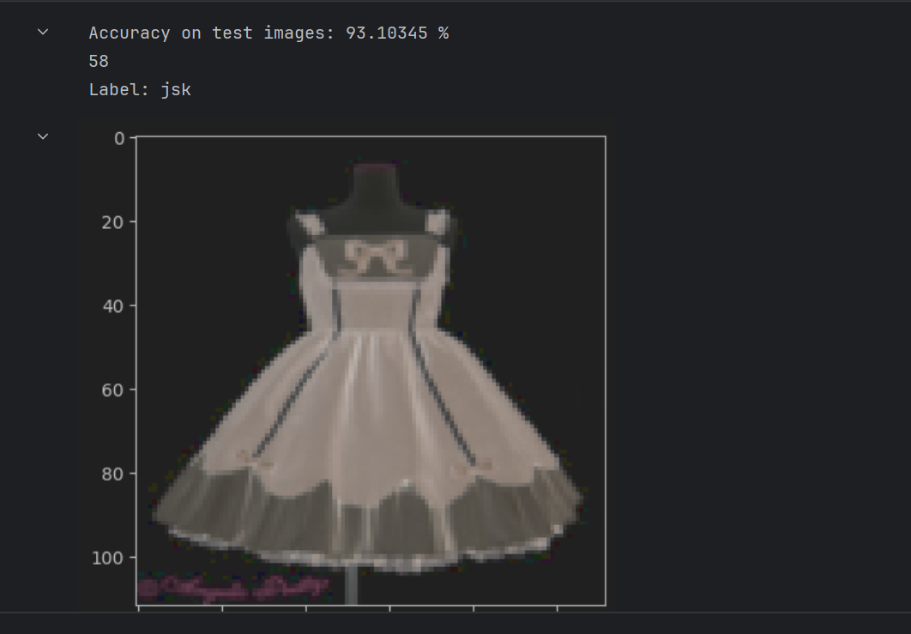

这周的研究内容是论文的第三章“提出方法”的部分，还有是自己尝试使用VGGnet对数据集进行处理。 

/今週の研究は、論文の第3章「提案された方法」と、VGGnetを使用してデータセットを処理する私自身の試みです。

接下来先对论文进行讲解 /次に、論文について説明しましょう。：
### 提出方法 /提案された方法
提出了H-CNN对服装图像进行层次结构分类：
1. 对比效果 实现了其他没有层次结构的基本模型与H-CNN进行对比
2. 验证有效 在VGGnets中使用最广泛的VGG16和VGG19上提出H-CNN
因为实现了知识嵌入式分类器而且通过构建网络，可以按照层级依次给出类别标签，输出每个输入的层次信息，因此H-CNN模型具有新颖性和更高的强度。

/H-CNN は、衣服の画像を階層的に分類するために提案されています
1. 比較効果 階層のない他の基本モデルをH-CNNと比較すます
2. 動作を確認する H-CNNは、VGGnetで最も広く使用されているVGG16およびVGG19で提案されています
知識埋め込み型分類器を実装し、階層に従って順番にカテゴリラベルを与えることができ、ネットワークを構築することで各入力の階層情報を出力できるため、H-CNNモデルは新規性が高く、強度が高いです。
#### 3.1 基本模型 /基本モデル
VGG16和VGG19都由下图所示的五个模块组成。 /VGG16 と VGG19 は、下図に示すように 5 つのモジュールで構成されています。

这个模型是普通的CNN模型，在网络末端输出单个多类标签。
1. VGG16 卷积层x2、池化层、卷积层x3、池化层、卷积层x3
2. VGG19 卷积层x2、池化层、卷积层x4、池化层、卷积层x4

/このモデルは通常の CNN モデルであり、ネットワークの最後に 1 つの多クラス ラベルを出力します。
1. VGG16畳み込み層x2、プール層、畳み込み層x3、プール層、畳み込み層x3
2. VGG19 畳み込み層 x2、プーリング層、畳み込み層 x4、プーリング層、畳み込み層 x4

在基本的CNN模型中前两个区块由两个卷积层和一个池化层组成。而VGG16模型的第三、第四个区块由三个卷积层和一个池化层组成，第五个区块有三个卷积层。而VGG19模型的第三、第四个区块由四个卷积层和一个池化层，相较于VGG16多了一个卷积层，而最后一个区块有四个卷积层，相较于VGG16多了一个卷积层。
激活函数为ReLu。为了防止过拟合，在完全连接的层之间进行dropout正则化处理。在预测块中，使用softmax函数将4096个通道划分为10类。

/基本的な CNN モデルでは、最初の 2 つのブロックは 2 つの畳み込み層と 1 つのプーリング層で構成されます。 VGG16 モデルの 3 番目と 4 番目のブロックは 3 つの畳み込み層と 1 つのプーリング層で構成され、5 番目のブロックは 3 つの畳み込み層で構成されます。 VGG19 モデルの 3 番目と 4 番目のブロックは、4 つの畳み込み層と VGG16 よりも 1 つ多い畳み込み層を持つ 1 つのプーリング層で構成され、最後のブロックは VGG16 よりも 1 つ多い畳み込み層である 4 つの畳み込み層があります。
活性化関数はReLuです。 過学習を防ぐために、全結合層間でドロップアウト正則化が実行されます。 予測ブロックでは、4096 チャネルはソフトマックス関数を使用して 10 のクラスに分割されます。
#### 3.2 H-CNN模型 /H-CNNモデル
该论文提出的H-CNN模型也像基础模型一样由五个模块组成。下图描述了H-CNN模型的架构：

/本稿で提案するH-CNNモデルも、基本モデルと同様に5つのモジュールから構成される。 次の図は、H-CNN モデルのアーキテクチャを示しています。

1. VGG16 H-CNN模型 卷积层x2、池化层（第一粗级块）、卷积层x3（第二粗级块）、池化层、卷积层x3（精细级块）
2. VGG19 H-CNN模型 卷积层x2、池化层（第一粗级块）、卷积层x4（第二粗级块）、池化层、卷积层x4（精细级块）

/
1. VGG16 H-CNNモデル 畳み込み層×2、プーリング層(第1粗いブロック)、畳み込み層×3(第2粗いブロック)、プーリング層、畳み込み層×3(細かいブロック)
2. VGG19 H-CNNモデル 畳み込み層×2、プーリング層(第1粗ブロック)、畳み込み層×4(第2粗ブロック)、プーリング層、畳み込み層×4(微細ブロック)

在每个预测块后面放了三个额外的块，输出了三个级别的分类标签，这与基本模型有所不同。下面的第一个分支表示第一个粗级块，第二个分支表示第二个粗级块，以及精细级块的最后一个分支。所有3个额外的块都由全连接的神经网络组成。当输入图像经过H-CNN模型时，依次计算粗1级、粗2级、细级三个预测值。

/各予測ブロックの背後には 3 つの追加ブロックが配置され、基本モデルとは異なる 3 つのレベルの分類ラベルが出力されます。 下の 1 番目の分岐は 1 番目の粗レベル ブロックを表し、2 番目の分岐は 2 番目の粗レベル ブロックを表し、詳細レベルのブロックの最後の分岐を表します。 3つの追加ブロックはすべて、完全に接続されたニューラルネットワークで構成されています。 入力画像がH-CNNモデルを通過すると、粗レベル1、粗レベル2、細かいレベルの予測値が順次計算されます。

例如，当毛衣的图像作为输入图像时，输出预测时，第一个粗级分支将指示“衣服”，第二个粗级分支将指示“上衣”，最后一个分支将指示“套头衫”。

/例えば、セーターの画像を入力画像として用いた場合、予測が出力されると、最初の太い枝は「服」、2番目の太い枝は「上」、最後の枝は「プルオーバー」を示します。

其余参数与上述普通的VGGnet模型无异，仅仅添加了额外的块以便进行对比。

/残りのパラメータは、比較のためにブロックが追加されている点を除いて、上記の通常のVGGnetモデルと同じです。
### 实验部分 /実験セクション
使用了torchvision中内置的vgg16模型对自己准备的数据集进行训练，data中有两个文件夹——jsk和op，每个文件夹中都有150张左右的图片。

/用意したデータセットでTorchVisionに組み込まれたVGGG16モデルを使ってトレーニングをしたところ、データ内にJSKとOPの2つのフォルダがあり、各フォルダには約150枚の画像が入っていました

导入一些必须的包 /必要なパッケージのいくつかをインポートします：
```py
import os
import random
import numpy as np
import matplotlib.pyplot as plt
import torch
from torch.utils import data
import torch
import torchvision
import torch.optim as optim
from torchvision import transforms
import torch.nn as nn
import cv2
from PIL import Image
```
读取图片路径，赋予标签，以及数据集的划分。 /イメージ パスを読み取り、ラベルを割り当て、データセットを分割します。
```py
all_files = []

for root, dirs, files in os.walk("./data"):
    for f in files:
        if f.endswith(".jpeg"):
            
            f_path = os.path.join(root,f)
            label = 0 if os.path.basename(root) == "op" else 1 #op的标签为0，jsk的标签为1 /OP のラベルは 0 で、JSK のラベルは 1 です
            all_files.append([f_path,label])
random.shuffle(all_files)#打乱图片的路径和标签的顺序 /画像のパスとラベルの順序をスクランブルします

spl = int(0.2*len(all_files))#训练集和测试集划分 /トレーニング セットとテスト セットを分割します
train_files = all_files[spl:]#训练集的图片路径和标签 /トレーニングセットの画像パスとラベル
test_files = all_files[:spl]#测试集的图片路径和标签 /テスト セットのイメージ パスとラベル
print(train_files)

```


对mydataset进行编写：
```py
# 对数据进行转换处理 /データの変換
       
transform = transforms.Compose([
                transforms.Resize((112,112)), 
                transforms.ToTensor() 
])
class Mydataset(data.Dataset):
    def __init__(self, files1,  transform1):
        self.data_list = files1
        self.transforms = transform1

    def __getitem__(self, index):
        # 根据索引，从列表中取出一个图像 /インデックスに基づいて、リストから画像を取得します
        image_path, label_1 = self.data_list[index]
        image1 = cv2.imread(image_path)
        image1 = cv2.cvtColor(image1, cv2.COLOR_BGR2RGB)
        # 应用数据处理方法到图像上 /画像へのデータ処理方法の適用
        image1 = Image.fromarray(image1)
        image1=self.transforms(image1)
        return image1, label_1

    def __len__(self):
        return len(self.data_list)
```
获取到测试集数据和训练集数据，并且定义并初始化数据读取器。 /テスト セット データと学習セット データを取得し、データ リーダーを定義して初期化します。
```py

# 打印数据集样本数  /印刷されたデータセットのサンプル数  
trainset = Mydataset(train_files,transform)
testset = Mydataset(test_files,transform)

print('train_dataset images: ',len(trainset))
print('test_dataset images: ',len(testset))
# 定义并初始化数据读取器 /データ リーダーの定義と初期化
train_loader = data.DataLoader(trainset, batch_size=20, shuffle=True)
test_loader=data.DataLoader(testset, batch_size=20, shuffle=True)
```

将处理过的图片随机打印出来一张看看 /処理された画像のランダムな画像を印刷して、見てください。：
```py
for data in trainset:
    image, label = data
    print('shape of image: ',image.shape)
    plt.title(str(label))
    plt.imshow(image[0,:,:])    
    break

```

使用预处理过的VGG16进行训练，迭代5个epoch，每次输入20张图片，每过10个batch打印一下loss。

/前処理されたVGG16を学習に用い、5エポックを反復し、一度に20枚の画像を入力し、10バッチごとに損失を印刷した。
```py
model = torchvision.models.vgg16(pretrained=True)
num_classes = 2  # 获取类别数量 /カテゴリの数を取得すます
model.classifier[6] = nn.Linear(4096, num_classes)  # 修改最后一层的全连接层　/最後のレイヤーの全結合レイヤーを変更すます

import warnings
warnings.filterwarnings("ignore", category=UserWarning)

criterion = nn.CrossEntropyLoss() # 使用交叉熵函数 /クロスエントロピー関数を使う
optimizer = optim.SGD(model.parameters(), lr=0.001, momentum=0.9)# 随机梯度下降（SGD）优化器  /確率的勾配降下法(SGD)オプティマイザー 

device = torch.device("cuda" if torch.cuda.is_available() else "cpu")
model.to(device)

for epoch in range(5):  # 迭代训练5个epoch /5 つのエポックを繰り返し学習させる
    running_loss = 0.0
    for i,n in enumerate(train_loader, 0):
        inputs, labels = n[0].to(device), n[1].to(device)
        
        optimizer.zero_grad() ## 梯度清零 /gradation clear
        outputs = model(inputs)
        
        loss = criterion(outputs, labels)
        loss.backward()
        optimizer.step() #计算损失、反向传播、更新参数 /損失の計算、バックプロパゲーション、パラメータの更新
        
        running_loss += loss.item()
        if i % 10 == 9:  # 每10个batch打印一次损失 / 損失は10バッチごとに印刷されます
            print('[%d, %5d] loss: %.5f' % (epoch + 1, i + 1, running_loss / 200))
            running_loss = 0.0

```


设置测试集，输出正确率以及训练后的图片及其对应标签。 /テスト セットを設定し、精度を出力し、トレーニング イメージとそれに対応するラベルを出力します。
```py
#测试集 /テストセット
correct = 0
total = 0
trained_labels = []
trained_images = []
label11=[]

with torch.no_grad():
    for data in test_loader:
        images, labels = data[0].to(device), data[1].to(device)
        outputs = model(images)
        _, predicted = torch.max(outputs.data, 1)
        
        total += labels.size(0)
        correct += (predicted == labels).sum().item()
        trained_labels.extend(predicted.tolist())
        trained_images.extend(images.tolist())
print('Accuracy on test images: %.5f %%' % (100 * correct / total))

print(len(trained_images))

for i in range(len(trained_labels)):
    label = trained_labels[i]
    label = "op" if label == 0 else "jsk"
    label11.append(label)
    image = trained_images[i]
    # 将图片数据转换为Tensor / 画像データを Tensor に変換する
    image_tensor = torch.tensor(image)
    image_tensor = image_tensor.permute(1, 2, 0)

    #打印标签和图片 /ラベルと画像を印刷する
    print("Label:", label)
    plt.imshow(image_tensor)
    plt.show() 
print(label11)
      

```
