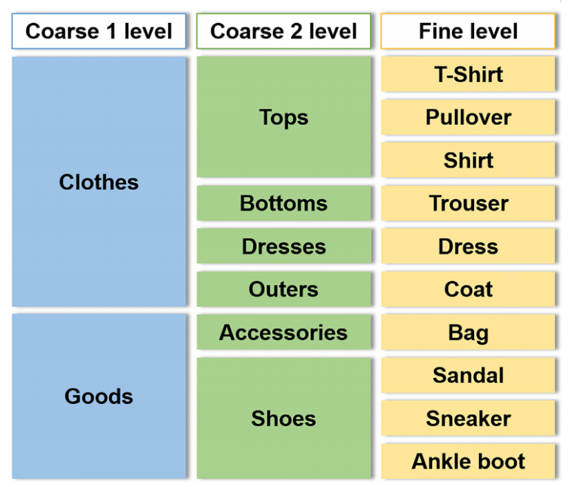
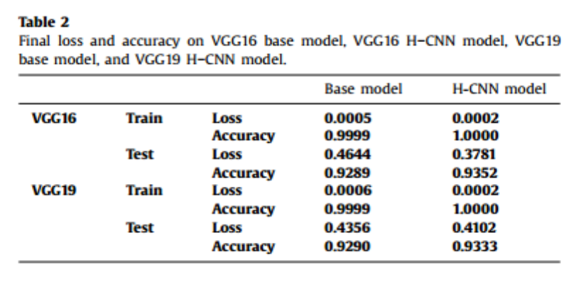
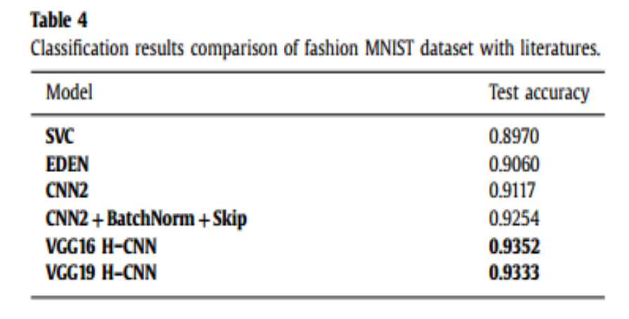
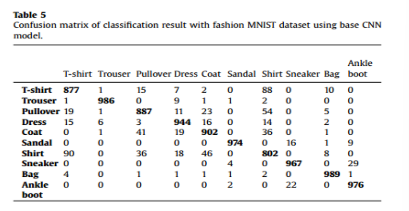

本周的任务就是将论文的剩余部分完结，虽然还剩下几章但都是实验相关的内容，大多数对参数的介绍，因此可以放到一起总结。

/今週のタスクは、まだいくつかの章が残っていますが、それらはすべて実験に関連しており、ほとんどのパラメータが紹介されているので、それらをまとめることができます。
### 实验 /実験
数据集为Fashion-MNIST，分为10类。可以重组为两个粗类和一个细类，具体内容如图所示 /データセットは Fashion-MNIST で、10 のカテゴリに分かれています。 図に示すように、2 つの粗いクラスと 1 つの細かいクラスに再編成できます。：

图中的分类与H-CNN的模型架构是匹配的。 /図の分類は、H-CNN のモデル アーキテクチャと一致します。

在训练H-CNN模型时增加了减重值，为了反映每个级别的类重要性的差异，在每个级别上应用不同的损失权值。在初始化阶段，底层特征提取对结果影响很大，所以赋值比后期阶段高。

/H-CNN モデルのトレーニング時に減量値を追加し、各レベルでのクラス重要度の違いを反映するために、各レベルで異なる損失の重みを適用しました。 初期化段階では、基礎となる特徴抽出が結果に大きな影響を与えるため、後の段階よりも割り当てが高くなります。
### 结果 /結果
将VGG16 H-CNN模型与VGG16基础模型、VGG19 H-CNN模型与VGG19基础模型的结果进行比较：

/VGG16 H-CNNモデルの結果をVGG16ベースモデルと比較し、VGG19 H-CNNモデルとVGG19ベースモデルを比較しました。

总的来说，当比较H-CNN模型的基本模型和精细类的预测值时，H-CNN模型在训练集和测试集上都具有更低的损失和更高的准确率。

/全体として、基本モデルとH-CNNモデルのファインクラスの予測値を比較すると、H-CNNモデルはトレーニングセットとテストセットの両方で損失が低く、精度が高くなっています。

H-CNN与其他模型进行对比 /H-CNN を他のモデルと比較します：

CNN2+BatchNorm+Skip模型由两个卷积和最大池化层组成，表示为CNN2，通过批处理归一化训练，表示为BatchNorm，残差跳跃连接，表示为skip。支持向量分类器(SVC)和进化深度学习(EDEN)。

/CNN2+BatchNorm+Skip モデルは、2 つの畳み込みと最大プーリング層 (CNN2 と表記) で構成され、バッチ正規化によってトレーニングされ (BatchNorm)、残余ホップ結合 (skip) されます。 ベクトル分類器 (SVC) と進化的深層学習 (EDEN) のサポート。

在VGG16和VGG19两种架构下观察到H-CNN模型可以获得更好的性能。 /H-CNN モデルは、VGG16 および VGG19 アーキテクチャでより優れたパフォーマンスが得られることが観察されています。
### 讨论 /話し合う
该论文提出的分类器在服装分类研究中表现出比基础分类器更好的性能。作为知识嵌入分类器，它在多阶段输出学习策略后提供层次结构的附加信息，而不是提供单一标签输出，具有一定的优势。

/本論文で提案する分類器は、衣服分類研究において基本分類器よりも優れた性能を示す。 知識が埋め込まれた分類子として、単一のラベル出力を提供するのではなく、学習戦略の多段階出力の後に階層の追加情報を提供するという点で特定の利点があります。

但是这种预先定义数据集层次标签的过程也可以通过数据驱动的方法来完成。
/ただし、データセットの階層ラベルを事前に定義するこのプロセスは、データ駆動型のアプローチでも実行できます。

在训练H-CNN分类器之前，可以先训练没有层次分类器嵌入的基本CNN模型，然后输入测试集，得到分类结果的混淆矩阵。然后比较每个类别的测试图像的值。发现了在一些被错分的数据中，某些类别被分错的概率更高。通过比较混淆矩阵和误分类样本的值，我们可以推断出服装类别之间的相似性和关系，并在此基础上定义服装类别的层次。

/H-CNN 分類器を学習させる前に、階層型分類器を埋め込まずに基本的な CNN モデルを学習させ、テスト セットを入力して分類結果の混同行列を取得できます。 次に、各カテゴリのテスト画像の値が比較されます。 誤分類されたデータの中には、特定のカテゴリが誤分類される確率が高いものがあることがわかりました。 混同行列と誤分類されたサンプルの値を比較することで、衣料品カテゴリ間の類似点と関係を推測し、これに基づいて衣料品カテゴリの階層を定義することができます。

在这个例子中，衬衫和t恤可能会被错误地分类，并且可能属于同一个粗略类别。然而，我们发现这一部分超出了范围，并没有进一步的实验，因为本文的重点是提出使用CNN对服装分类的层次结构的考虑，而不是层次结构的定义方式。

/この例では、シャツと T シャツが誤って分類され、同じ大まかなカテゴリに分類される可能性があります。 しかし、このセクションは範囲を超えており、この論文の焦点は、階層がどのように定義されているかではなく、CNNを使用して衣服の分類の階層の考察を提示することであるため、それ以上の実験はされていません。
### 结论 /結論
层次卷积神经网络(H-CNN)将服装类的层次结构应用到服装图像的分类过程中，H-CNN架构基于VGGNet，由多个卷积层、最大池化层和全连接层组成的五个构建块组成。将该架构应用于Fashion-MNIST数据集。

/階層型畳み込みニューラルネットワーク(H-CNN)は、衣服クラスの階層構造を衣服画像の分類プロセスに適用し、H-CNNアーキテクチャは、複数の畳み込み層、最大プーリング層、全結合層を含む5つのビルディングブロックで構成されるVGGNetに基づいています。 スキーマは Fashion-MNIST データセットに適用されます。

我们将数据集重新分类为三个级别的类，当输入图像经过本文提出的H-CNN模型时，将依次计算粗1级、粗2级、细级三个预测值。

/データセットを3つのレベルのクラスに再分類し、本論文で提案したH-CNNモデルを入力画像が通過すると、粗い1、粗い2、細かい3つの予測が順番に計算されます。

我们进行了两个实验，一是将VGG16 H-CNN模型与VGG16基础模型进行对比，二是将VGG19 H-CNN模型与VGG19基础模型进行对比。结果表明，使用H-CNN模型比基本模型具有更低的损失和更高的精度。这意味着可以通过在CNN上反映层次结构来解决服装图像分类的困难。

/VGG16 H-CNNモデルとVGG16ベースモデルの比較実験と、VGG19 H-CNNモデルとVGG19ベースモデルの比較実験の2つの実験を行いました。 その結果、H-CNNモデルは基本モデルよりも損失が小さく、精度が高いことが分かりました。 つまり、衣服画像分類の難しさは、階層をCNNに反映させることで解決できるということです。

我们的方法的贡献在于提出的模型不局限于单一的分类器，而是知识嵌入分类器，该分类器经过训练可以输出传递层次信息的多层分类标签。本文用启发式方法定义了这种层次结构。

/本アプローチの貢献は、提案モデルが単一の分類器に限定されず、階層情報を伝える多層分類ラベルを出力するように訓練できる知識埋め込み型分類器であるという事実にあります。 この記事では、この階層をヒューリスティックな方法で定義します。

在未来的研究中，可以进一步的开发，因为Fashion MNIST数据集是直接用于分析的精炼数据集，与真实在线的服装图像有很大差异。在网上获得的图片大多数没有经过标记的，这时候应用半监督学习比较好。

/Fashion MNISTデータセットは、実際のオンラインの衣料品画像とは大きく異なる、分析に直接使用される洗練されたデータセットであるため、今後の研究ではさらに発展させることができます。 インターネットで得られた画像のほとんどはマークされておらず、半教師あり学習を適用することをお勧めします。

在不同的数据集或者不同的架构上训练，找出最适合实现H-CNN模型的CNN架构。
由于CNN被广泛用于非手工特征提取，所以只考虑CNN作为我们的分类器，只在CNN上实现层次方法。在进一步的研究中利用其他特征提取方法实现CNN的层次集成模型。

/さまざまなデータセットまたはさまざまなアーキテクチャでトレーニングを行い、H-CNN モデルを実装するのに最適な CNN アーキテクチャを見つけます。
CNNは非手動の特徴抽出に広く使用されているため、CNNのみが分類器と見なされ、階層的手法はCNNにのみ実装されます。 さらなる研究では、CNNの階層アンサンブルモデルを実現するために、他の特徴抽出法が使用されています。

最后，针对层次结构，采用启发式方法定义服装数据集的层次标签，在未来的研究中，希望进一步将数据驱动方法应用到其他实验中，并将结果与启发式方法进行比较。

/最後に、階層構造については、ヒューリスティック法を用いて衣料品データセットの階層ラベルを定義し、今後の研究では、データ駆動型法をさらに他の実験に応用し、その結果をヒューリスティック法と比較することが期待されます。

