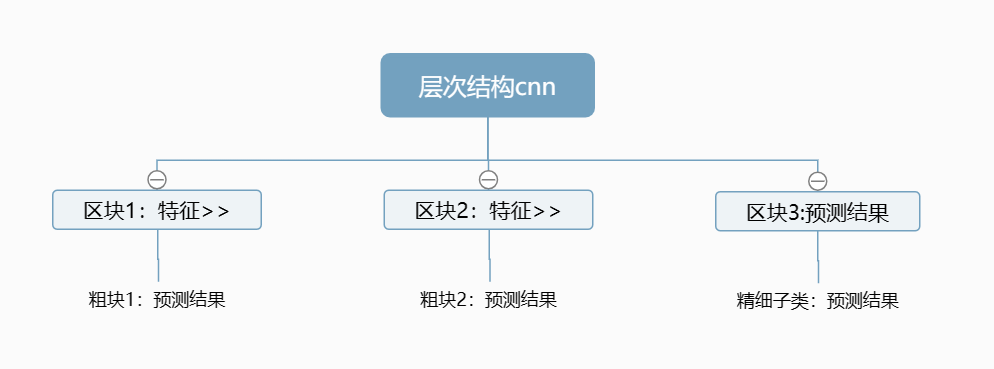

上周和这周因为考试和生病的原因没有产出，这周的最后一点点时间把分析完论文的感受和收获总结一下。
### 该论文的核心以及创新
该论文的核心是将层次结构应用在cnn网络上，比起普通的cnn网络，在每一个区块下输出一个新的标签。

论文创新就是提出了应用了层次结构的cnn网络对服装图像分类的贡献，由先分粗类再分细类这种层层精确的方法使分类结果更准确，尤其是对于类别多、类别之间区别不是很大的服装图像效果很好。
### my idea
该论文中提出了一个问题，实验所用的数据集是fashion-mnist，该数据集里的图像是已经处理好的专门用于训练的服装图像，但是我们日常生活中常见的服装图像往往并不是统一、整齐的，因此服装特征提取就非常重要了，如果不能从日常生活中常出现的服装图像中提取到有效特征，那么细化分类也是纸上谈兵。因此我认为该网络需要改进的地方是对于服装特征的提取、排除各种干扰因素。
而对于我即将进行的Lolita服装分类来说，该网络的结构过于复杂了，但是这种逐步细分的思想还是值得学习的。例如：在op（有袖连衣裙）、jsk（无袖连衣裙）、sk（半身裙）三大类中可以通过有无上半身先区分出sk，然后通过有无袖子区分出jsk和op，再通过袖子的长度区分是该op是短袖、中袖还是长袖，由此一步步细化分类结果。
### 未来展望
在线上购物网站识图、推荐相似产品等场景使用应用层次结构的cnn网络将会有比较好的效果，相对于单一的cnn网络，应用层次结构的cnn网络的准确率会更高，并且对于这种分类类别较多、难区分的问题解决会有更好的效果。如果将服装所带有的独特地区文化作为标签，那么对于不同国家、不同地区的服装分类时也会有很好的效果，例如对于传统服饰的分类，先确定大致的地位位置，如欧洲服饰、亚洲服饰等等，再向下寻找，确定国家，最后确定民族。这样抽丝剥茧，层层递进的寻找。

论文的总结就到此为止啦~