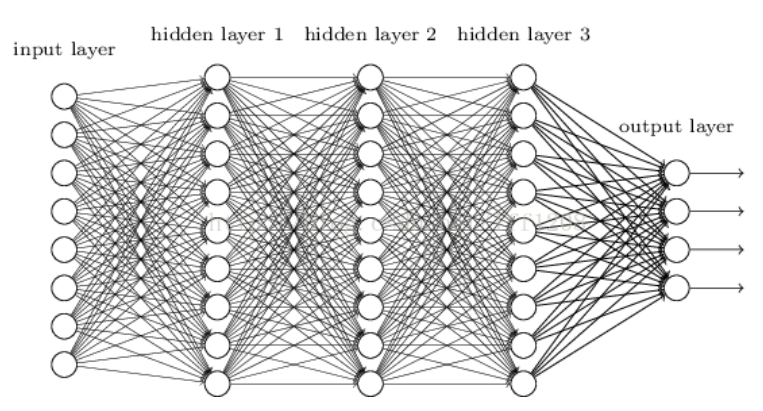
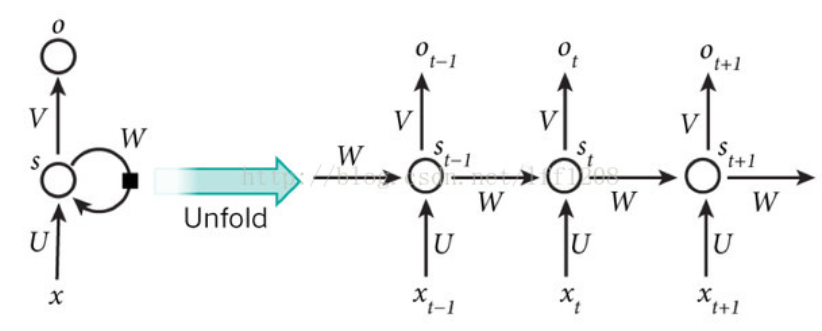

深度学习，也被称为深度神经网络（DNN），如卷积神经网络（CNN）和循环神经网络（RNN）。

CNN我们之前在摘要部分已经介绍过了，现在简单介绍一下等DNN和RNN。深度神经网络（Deep Neural Networks），要介绍DNN不得不说起神经网络的起源，早期的神经网络结构非常简单，包含有输入层、输出层和一个隐藏层，被称为感知机。
1. 输入层 输入特征
2. 隐藏层 对特征进行处理变换
3. 输出层 得到分类结果

是不是跟CNN很相像呢？说回感知机，一开始的感知机是单层感知机，也就是说隐藏层只有一层，可想而知，对于复杂数据的处理能力就非常差了。于是后面出现了多层感知机，多个隐藏层之间使用sigmoid或tanh等连续函数模拟神经元对激励的响应。但是由于层数增加反而更容易陷入局部最优解，同时也会出现“梯度消失”的问题（梯度值等于0），于是为了克服这些问题DNN出现了。使用ReLU、maxout等传输函数代替sigmoid，形成了如今DNN的基本形式。

DNN与多层感知机的结构是一样的，只是激活函数改变了。所有神经元都是全连接的结构，因此很容易出现参数膨胀问题，容易过拟合和陷入局部最优解。

在之前有提到过CNN的卷积层、池化层、全连接层，卷积层可以通过卷积核提取到大量特征，而池化层是精简了提取到的特征，与DNN对比优化了参数爆炸以及过拟合等问题了。

RNN对比DNN和CNN来说稍微有点特殊，它的特殊之处在于它是一个有记忆的神经网络。有记忆？！这也太玄学了吧！当我们通过其结构来探究的时候，就会发现科学但神奇。

乍一看上面的图片非常抽象，但是其实忽视掉循环，就是一个普通的神经网络结构：输入层、输出层以及隐藏层。那么在隐藏层的循环是什么意思呢？这就要提到前面说的记忆了，一般的图像分类不需要关注图片与图片之间的关系，因为大多数图片都是独立的。但是如果是对语言进行处理的话，那么语序和语境就十分重要了。

例如，“我想要苹果”这句话，如果语序改变成“苹果想要我”那么意思就完全不一样了‘或者在不同的语境下，意思也完全不一样，“想换手机了，我想要苹果”和“想吃水果了，我想要苹果”也完全不一样，前者指的是手机，而后者指的是水果。在这种情况下整段话的语序是不能被打乱的，那么结合上图的循环过程看，St-1的阶段提取到“手机”，St阶段提取到”苹果“，St-1阶段提取到就是手机-苹果。或者是“水果”、“苹果”、“水果-苹果”。这样最后输出的特征就是一个与前文有关联的特征，也就是说RNN记住了之前输入的特征，这就是为什么说RNN是有记忆的神经网络。