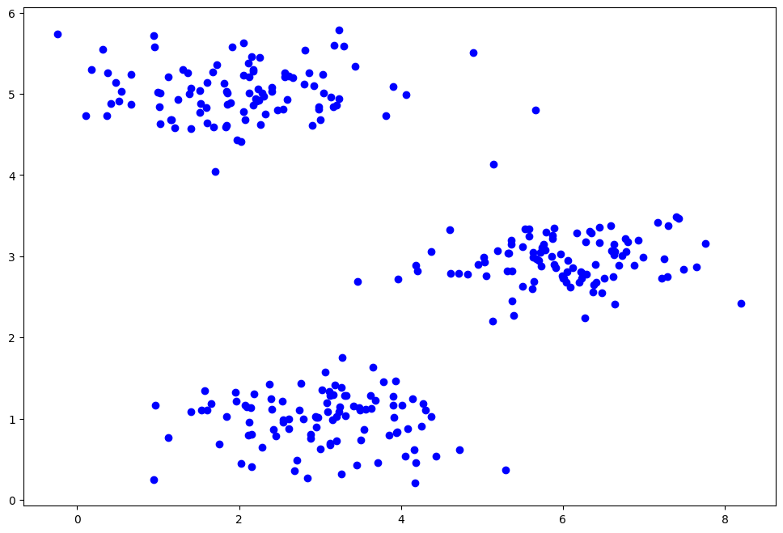
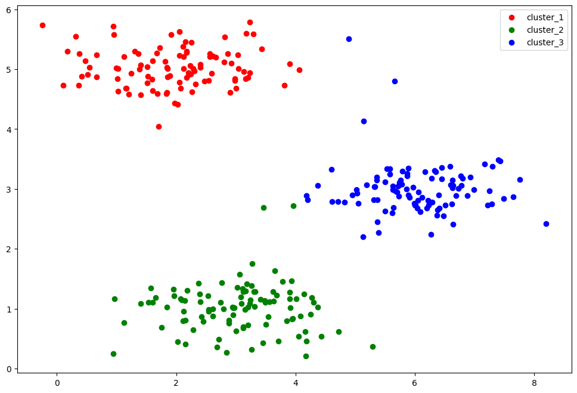
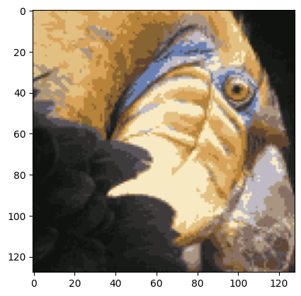
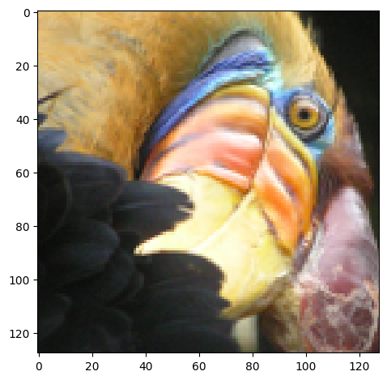
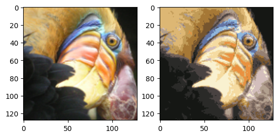

## 无监督学习 （Unsupervised Learning）
通过k-means算法的学习，算是正式步入了无监督学习的大门。那么再介绍k-means之前先介绍一下无监督学习吧~
首先在之前的学习中，知道了监督学习和无监督学习的区别在于有无标签的输入。而无监督学习主要方向是聚类，聚类顾名思义就是物以类聚，人以群分。

/k-meansアルゴリズムを学ぶことで、教師なし学習の扉に正式に足を踏み入れた。 そこでk-meansを紹介する前に、教師なし学習を紹介しよう。まず、これまでの研究で、教師あり学習と教師なし学習の違いは、ラベル付き入力の有無であることが知られている。 そして、教師なし学習の主な方向性はクラスタリングであり、クラスタリングとはその名の通り、牛は牛連れ、馬は馬連れ。
### 聚类(Clustering)
聚类是按照某个特定标准(如距离)把一个数据集分割成不同的类或簇，使得同一个簇内的数据对象的相似性尽可能大，同时不在同一个簇中的数据对象的差异性也尽可能地大。也即聚类后同一类的数据尽可能聚集到一起，不同类数据尽量分离。
这么说可能有点抽象，通俗的来说就是把相似的数据划分到一起，就像合得来的人聚在一起一样。

/クラスタリングとは、データセットを特定の基準（距離など）に従って異なるクラスまたはクラスタに分割するプロセスであり、同じクラスタ内のデータオブジェクトは可能な限り類似しており、同時に同じクラスタに含まれないデータオブジェクトは可能な限り異なっている。 つまり、クラスタリングの結果、同じクラスのデータは可能な限り集められ、異なるクラスのデータは可能な限り分離される。
少し抽象的かもしれないが、一般論としては、気の似合う人が集まるように、似たようなデータを一緒に分けることである。
### k-means
而接下来介绍的k-means算法就能很好的划分数据集，它的工作原理是先规定好需要划分的簇类或聚类中心，就像一个班级里的人需要分成小组，那么分成几组或者以哪些人为组长是要首先确定的。接着通过反复迭代，直至达成"簇内的点足够近，簇间的点足够远"的目标。也就是说分好了组选好了组长后由于各种各样的因素影响，最开始划分的小组内组员目标不一定都是一致的，那么会出现组员换组，选举换组长之类的现象。直至最后的小组成员目标一致、关系紧密、组长无可替代，同时每个组做事风格差别极其大，这时候整个班才算被完美的分成三个完全不同的组。

/ 次に紹介するK平均法アルゴリズムは、データセットをうまく分割することができ、その動作原理は、クラスの人々をグループに分割する必要があるのと同じように、分割する必要のあるクラスターまたはクラスターセンターを最初に指定することです。 その後、繰り返しの繰り返しを経て、「クラスター内のポイントが十分に近く、クラスター間のポイントが十分に離れている」という目標が達成されるまで。 つまり、グループを分割してリーダーを選出した後、さまざまな要因により、最初に分割されたグループのメンバーの目標が同じでない場合があれば、グループを変更してリーダーを選出してなどの現象が発生します。 最終的なグループメンバーが同じ目標、緊密な関係、かけがえのないグループリーダーを持ち、各グループの仕事のスタイルが非常に異なり、その時点でクラス全体が3つの完全に異なるグループに分割されるまでではありません。
接下来通过demo进一步讲解k-means算法的过程。 /k-meansアルゴリズムのプロセスは、次にデモを通してさらに説明される。
## k-means demo
经典导入所需要的包 /必要なパッケージをインポートする：
```py
import numpy as np
import pandas as pd
import matplotlib.pyplot as plt
import scipy.io as sio
```
读取初始数据，画图展示 /初期データを読み、図を書いて示す：
```py
data = sio.loadmat("data/ex7data2.mat")
X = data['X']
fig, ax = plt.subplots(figsize=(12,8))
ax.scatter(X[:,0], X[:,1],c="b")
plt.show()
```

定义函数find_closest_centroids()找到数据中每个实例最接近的聚类中心的数据，centroids是数据点初始化中心，k-means算法的一个特点是初始质心对聚类结果和运行时间有着很大影响，所以最好是手动设置（一般输入为点坐标的数组）。

/関数 find_closest_centroids() を定義して、データ中の各インスタンスに最も近いクラスタリング中心を求めます。centroids はデータ点の初期化中心で、k-means アルゴリズムは初期セントロイドの特徴がクラスタリング結果と実行時間に大きな影響を与えるので、手動で設定するのが最善です（一般的な入力は点の座標の配列です）
```py
def find_closest_centroids(X, centroids):
    m = X.shape[0]#读取x第一维度的长度,即数据的条数 /xの最初の次元の長さ、すなわちデータの本数を読み取る
    k = centroids.shape[0]#读取点个数，即簇数 /読み取りポイントの数、つまり、クラスターの数です
    idx = np.zeros(m)#得到一个有m个元素的数组 /m個の要素を持つ配列を取得する
    
    for i in range(m): 
        min_dist = 1000000 #设置一个很大的初始最小距离 /大きな初期最小距離を設定する
        for j in range(k):
            dist = np.sum((X[i,:] - centroids[j,:]) ** 2)#遍历所有数据点以及中心点求方差和，得到一个数据点与某一中心点的距离 /すべてのデータポイントと中心点を反復処理し、分散の合計を見つけて、中心点からデータポイントの距離を取得します
            if dist < min_dist: #进行比较 /比較する
                min_dist = dist #更新最小的距离 /最小距離の更新
                idx[i] = j #将该最小距离的中心点下标值赋给idx数组 /この最小距離のセントロイド添え字の値をidx配列に代入する
    
    return idx #得到一个拥有各数据点对应的最近中心点的下标的数组 /各データ点に対応する最近傍のセントロイドの添え字を持つ配列を得る
```
设置初始质心，调用函数find_closest_centroids() /初期セントロイドを設定するには、関数 find_closest_centroids() を呼び出します：
```py
initial_centroids = np.array([[3, 3], [6, 2], [8, 5]]) #手动初始化三个聚类中心点 /3つのクラスタ・セントロイドを手動で初期化する
idx = find_closest_centroids(X,initial_centroids)#调用函数 /コール機能
print(idx[0:3]) #打印出前三个值看看是否成功 /最初の3つの値をプリントアウトして、うまくいったかどうかを確認する
```
定义函数compute_centroids()对目前靠近某个质心的数据点求均值 /compute_centroids()関数を定義して、あるセントロイドに近いデータ点の平均を求める：
```py
def compute_centroids(X, idx, k):
    m, n = X.shape
    centroids = np.zeros((k, n)) #定义一个数组存放新质心的坐标 /新しいセントロイドの座標を保存する配列を定義する

    for i in range(k):
        indices = X[np.where(idx == i)[0]]  # np.where找出在idx中与i值相等的值的下标，返回值类型是元组,[0]是取内部数据 /np.whereでidxとiの値が等しい添え字の値に見つけるために、戻り値の型はタプルであり、[0]は、内部データを取ることです
        centroids[i] = np.mean(indices, 0)  # 按列求均值 /列ごとに平均を求める

    return centroids #返回一个含有新质心坐标的数组 /新しいセントロイドの座標を含む配列を返す
```
构建k-means算法，X数据集，initial_centroids初始质心，max_iters最大迭代次数 /k-meansアルゴリズムの構築、Xデータセット、initial_centroids初期セントロイド、max_iters最大反復数：
```py
def run_k_means(X, initial_centroids, max_iters):
    m,n = X.shape
    k = initial_centroids.shape[0]
    idx = np.zeros(m)
    centroids = initial_centroids
    #开始进行迭代 /イテレーションの開始
    for i in range(max_iters):
        idx = find_closest_centroids(X,centroids) # 找到最近质心 /最も近いセントロイドを見つける。
        centroids = compute_centroids(X,idx,k) # 重新计算质心 /セントロイドを再計算する
        
    return idx,centroids 
```
运行k-means后，画图展示 / k-meansを実行した後、グラフを描く:
```py
idx, centroids = run_k_means(X, initial_centroids, 10)#运行k-means /k-meansを実行する
cluster_1 = X[np.where(idx==0)[0],:]#第一个簇内数据点 /最初のクラスター内データポイント
cluster_2 = X[np.where(idx==1)[0],:]#第二个簇 /第2クラスタ
cluster_3 = X[np.where(idx==2)[0],:]#第三个簇 /第3クラスタ
#画图 /グラフを描く
fig,ax = plt.subplots(figsize=(12,8))
ax.scatter(cluster_1[:,0],cluster_1[:,1],c='r', label='cluster_1')
ax.scatter(cluster_2[:,0],cluster_2[:,1],c='g', label='cluster_2')
ax.scatter(cluster_3[:,0],cluster_3[:,1],c='b', label='cluster_3')
ax.legend()
plt.show()
```

以上是k-means算法的实现过程，接下来是实现应用 /上記は、k-meansアルゴリズムの実装プロセスであり、次にアプリケーションの実装が続く：
```py
# 查看原始图片 /元の画像を見る
from IPython.display import Image
Image(filename='bird_small.png')
```

加载图片数据，并且查看 /画像データを読み込んで表示する：
```py
image_data = loadmat('bird_small.mat')
image_data.keys()  # 查看mat格式数据有哪些内容 /matフォーマットデータの中身を見る
data = image_data['A'] #获取数据 /データ取得
data.shape            # 图像为128*128 3通道的图片 /画像は128*128の3チャンネル画像
```
由于各通道数据的数值差别还比较大，需要对数据应用一些预处理。 /チャンネルデータの値はまだかなり異なるので、データに何らかの前処理を施す必要がある
```py
data = data / 255.

# 重置矩阵大小，将行数和列数合并，通道为单独的一维 /マトリックスのサイズをリセット、行と列を組み合わせる、チャンネルは一次元の独立したものである
X = np.reshape(data, (data.shape[0] * data.shape[1], data.shape[2]))
k = 16
max_iters = 10
X.shape
```
进行图像压缩 /画像圧縮の実行：
```py
# 随机初始化聚类中心 /クラスタ中心のランダムな初期化
init_centroids = random_init_centroids(X, k)
# 获取聚类中心 /クラスタリングセンターの取得
idx, centroids = run_k_means(X, init_centroids, max_iters)
# 将所有数据点归属到对应的聚类中心 /すべてのデータ点を対応するクラスタ中心に帰属させる
idx = find_closest_centroids(X, centroids)
# 将每一个像素值与聚类结果进行匹配 /各ピクセル値をクラスタリング結果とマッチさせる
X_recovered = centroids[idx.astype(int), :]  # 将属于一个聚类的像素，设置为聚类中心的值（统一） /クラスタに属するピクセルをクラスタ中心の値に設定します（一様）
# X_recovered.shape (16384, 3)
X_recovered = np.reshape(X_recovered, (data.shape[0], data.shape[1], data.shape[2])) # 再展开为三维数据 /3次元データへの展開
X_recovered.shape
```
展示出压缩后的图像 \圧縮画像を表示する：
```py
plt.imshow(X_recovered)
plt.show()
```


可以看到刚刚我们虽然压缩了图片，但是效果不是很好，清晰度变得很差，接下来使用scikit-learn的k-means算法压缩图像。 

/先ほど画像を圧縮しましたが、効果はあまりなく、鮮明さが非常に悪くなっていることがわかります。次に、scikit-learnのk-meansアルゴリズムを使って画像を圧縮します。
```py
from skimage import io

pic = io.imread('data/bird_small.png') / 255. # 加载图片并进行归一化处理 /画像を読み込んで正規化する
io.imshow(pic)
```

```py
pic.shape   # 查看图像数据形状信息，即：宽、高位128、128，3通道 /画像データの形状情報（幅、高さのビット128、128、3チャンネル）を表示する。

# 类似之前的操作，重置图像大小 /前の操作と同様に画像サイズをリセットする
data = pic.reshape(128*128, 3)
data.shape
#导入k-means库 /k-meansライブラリのインポート
from sklearn.cluster import KMeans
# 构建kmeans算法模型 /kmeansアルゴリズムのモデル化
model = KMeans(n_clusters=16, n_init=100)
# 开始训练 /トレーニング開始
model.fit(data)
```
```py
# 得到各簇中心点 /各クラスタのセントロイドを取得する
centroids = model.cluster_centers_  
print(centroids.shape)              # 查看簇的形状 \クラスターの形状を見る
C = model.predict(data)             # 获取每条数据所属簇 \各データが属するクラスタを取得する
C.shape

centroids[C].shape  
compressed_pic = centroids[C].reshape((128,128,3))
# 绘制原图和压缩图片 /オリジナル画像と圧縮画像の描画
fig, ax = plt.subplots(1, 2)
ax[0].imshow(pic)
ax[1].imshow(compressed_pic)
```

那么demo的部分也就到此为止啦~ /これでデモは終わり。