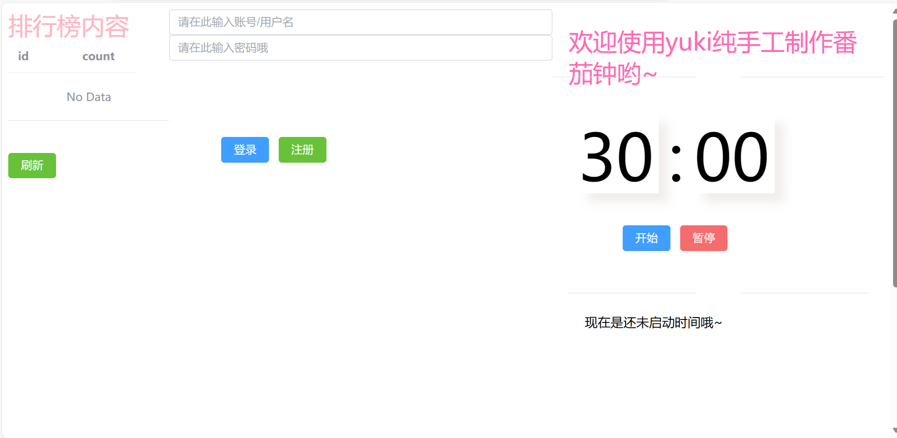
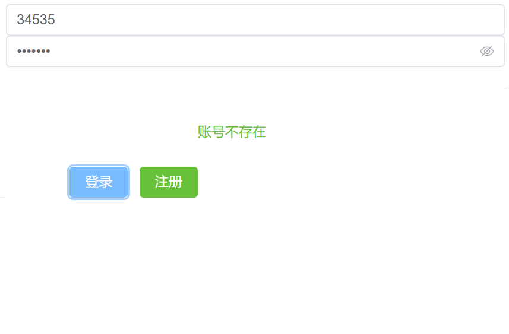
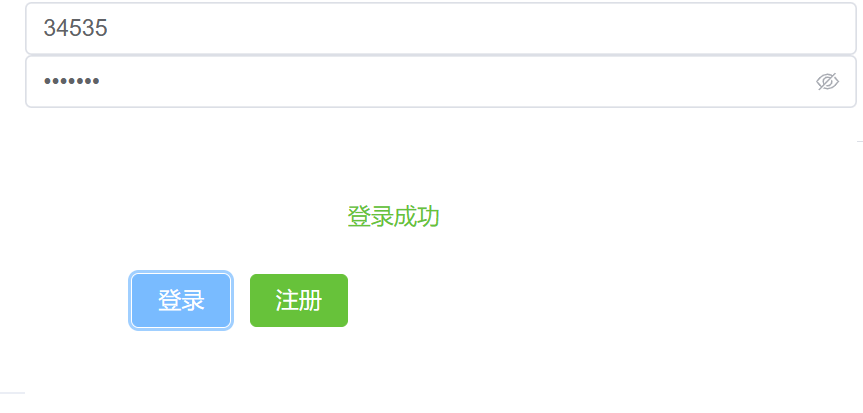
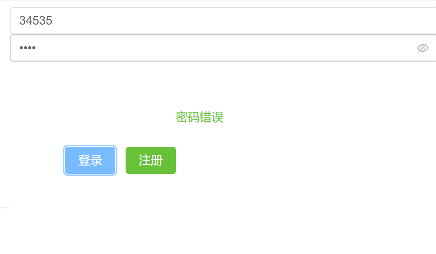
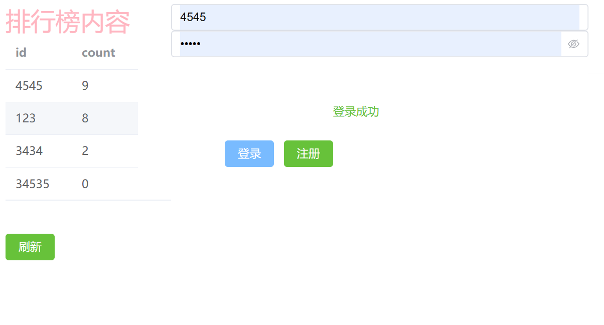

##### 日期: 2023-09-01 02:51:26
### 网页整体如下：


#### 前端vue所实现的功能：
#### 1.实现计时器功能，即一轮30分钟的倒计时，前25分钟工作，后五分钟休息。
>参考代码如下（写在script标签内的哦）：
```ts
//定义一些需要用到的变量
const seconds = ref(0);
const minutes = ref(30);
const state = ref(State.Init);
const is_pause = ref(false);
var timer: number | undefined;
var count=0;
const msg=ref("")

//定义三种不同的状态
enum State {
  Init, // 初始
  Working, // 工作
  Resting // 休息
}
//关于工作状态的设置
function message() {
  if (state.value === State.Init) {
    return "还未启动";
  } else if (state.value === State.Working) {
    return "工作";
  } else if (state.value === State.Resting) {
    return "休息";
  }
}
//根据当前时间数值返回不同状态
function clock() {
  if (minutes.value > 5 && minutes.value < 30) {
    state.value = State.Working;
  } else {
    state.value = State.Resting;
  }
}

```
###### 预期实现效果如下图所示
<blog src="./blog/clock——init.png" width="250">
<blog src="./blog/clock——working.png" width="250">
<blog src="./blog/clock——resting.png" width="250">
<blog src="./blog/worked.png" width="250">

>这里设定了一个计时器，timefn()函数控制了计时的开始，pauseFn()函数控制了计时的结束

```ts
function timeFn() {
  is_pause.value = false;
  clearInterval(timer);
  timer = window.setInterval(() => {
    clock()
    if (minutes.value <= 0 && seconds.value <= 0) {
      state.value = State.Init;//设置初始状态
      count=1;//后期用的计算轮数的变量，可以先忽略
      console.log(count);
      pauseFn();
      vue_count();//向后端传轮数的函数，可以先忽略
    } else {
      if (seconds.value == 0) {
        seconds.value = 60;
        minutes.value--;
      } else {
        seconds.value--;
      }
    }
  }, 1000);
  
}
//暂停倒计时
function pauseFn() {
  clearInterval(timer);
  is_pause.value = true;
}

```
>如果想要网页上提醒用户现在的状态，使用computed是非常方便的选择，参考代码如下：
```ts
const filled_minute = computed(() => fill(minutes));
const filled_second = computed(() => fill(seconds));

const message_state = computed(() => message());


function fill(in_num: Ref<number>) {
  if (in_num.value >= 10) {
    return in_num.value.toString();
  } else {
    return "0" + in_num.value.toString();//当倒计时到个位数时自动补零
  }
}

unction click() {
  if (minutes.value <= 0 && seconds.value <= 0) {
    
    minutes.value = 30;//当倒计时结束重新启动时把时间补回30分钟
    seconds.value = 0;
    timeFn();
    
  } else {
    timeFn();
  }
  

}
```
>绑定到网页上的按钮（template标签内）：
```ts
<template>
            <div style="width: 200px; height: 100px;clear: both;text-align: center;">
            <el-button style="margin-top: 20%;margin-left: 65px;" type="primary" @click="click">开始</el-button>
            <el-button style="margin-top: 20%;" type="danger" @click="pauseFn">暂停</el-button>
          </div>
          <el-footer>现在是{{ message_state }}时间哦~</el-footer>
</template>
 
```

>接下来是一些附加的功能，主要是注册登录和获取排行榜信息。预期实现效果如下图
使用没有注册过的账号登录，页面提示账号不存在以后进行注册：



注册成功以后登录：


当密码错误时进行提示：

#### 注册登录的参考代码如下:
vue（script标签中）内代码：
```ts
//请求
const aa = ref("");

// 注册
async function register() {
  let res = await axios.post("http://localhost:8888/register", //使用axios向后端发送请求
  {
    user_id: user.value,
    password: password.value,//发送了账号密码
    
  })
  if (res.status == 200) { // 如果成功执行
    aa.value = res.data//返回值是一个字符串“注册成功”
  }

}
//登录
async function login() {
  let res = await axios.post("http://localhost:8888/login", {
    user_id: user.value,
    password: password.value,
  })
  if (res.status == 200) { // 如果成功执行
    aa.value = res.data
  }
  vue_top();//后期获取排行榜使用的函数，可以先忽略
}
```
>vue（template标签中）内
```ts
<div style="widows: 80px;height: 80px;clear: both;">
        <el-input v-model="user" placeholder="请在此输入账号/用户名" />
        <el-input v-model="password" type="password" placeholder="请在此输入密码哦" show-password />

        <el-button style="margin-top: 20%;margin-left: 65px;" type="primary" @click="login">登录</el-button>
        <el-button style="margin-top: 20%;" type="success" @click="register">注册</el-button>

        <el-text class="mx-1" type="success">{{ aa }}</el-text>
      
```
#### 后端python出场啦
>后端python中参考代码：
```python
import sqlite3 #数据库用的sqlite3哦，记得自己在命令行里创建数据库
from fastapi import FastAPI
from fastapi.middleware.cors import CORSMiddleware # 用来支持跨域
import uvicorn # 相当于服务器的启动器
from pydantic import BaseModel # 用来定义POST请求接受的类型

app = FastAPI() # 定义后端服务器 
# 搜索关键词“跨域”，因为前端和后端不在同一个端口，所以为了安全，默认禁止互相访问，为了互相访问，我们需要跨域
# 参考 https://blog.csdn.net/moshowgame/article/details/107285660
app.add_middleware(
	CORSMiddleware,
	# 允许跨域的源列表，例如 ["http://www.example.org"] 等等，["*"] 表示允许任何源
	allow_origins=["*"],
	# 跨域请求是否支持 cookie，默认是 False，如果为 True，allow_origins 必须为具体的源，不可以是 ["*"]
	allow_credentials=False,
	# 允许跨域请求的 HTTP 方法列表，默认是 ["GET"]
	allow_methods=["*"],
	# 允许跨域请求的 HTTP 请求头列表，默认是 []，可以使用 ["*"] 表示允许所有的请求头
	# 当然 Accept、Accept-Language、Content-Language 以及 Content-Type 总之被允许的
	allow_headers=["*"],
	# 可以被浏览器访问的响应头, 默认是 []，一般很少指定
	# expose_headers=["*"]
	# 设定浏览器缓存 CORS 响应的最长时间，单位是秒。默认为 600，一般也很少指定
	# max_age=1000
)
#注释源自世界上最好的看我写不出来代码给我写了一份demo的好朋友，我自己写的注释离奇消失，直接把demo里的拿来用啦

#定义接收的对象
class RegisterInfo(BaseModel):
    user_id: str
    password: str

@app.post("/register")
def register(info: RegisterInfo):
    print(f"/register: User(id:{info.user_id}) registered.")

    # 链接数据库
    conn = sqlite3.connect('test.db')
    c = conn.cursor()
    print("成功连接数据库")
    # 向表中添加账号密码

    x: tuple[int] = c.execute(
        "select count(*) from user where id=?", (info.user_id,)).fetchone()
    print(x)
    # 注册
    n = x[0]
    if n > 0:
        print("已有账号")
        return "已有账号，请登录哦"
    else:
        c.execute("INSERT INTO USER (id, password,count) VALUES (?, ?,0)",
                  (info.user_id, info.password))
        conn.commit()
        print("数据插入成功")
        conn.close()
        return "注册成功~"
# 登录
@app.post("/login")
def login(info: RegisterInfo):
    print(f"/login: User(id:{info.user_id}) registered.")

    # 链接数据库
    conn = sqlite3.connect('test.db')
    c = conn.cursor()
    print("成功连接数据库")

    # 验证账号是否存在
    uid: tuple[int] = c.execute(
        "select count(*) from user where id=?", (info.user_id,)).fetchone()
    ps = c.execute("select count(*) from user where password=?",
                   (info.password,)).fetchone()
    cuid = uid[0]
    cps = ps[0]
    if cuid > 0 and cps > 0:
        return ("登录成功")
    elif cuid > 0 and cps == 0:
        print("cw")
        return ("密码错误")
    elif cuid == 0:
        print("bcz")
        return ("账号不存在")
    conn.commit()
    conn.close()

# 运行fastapi程序，定式（记得放底部哦）
if __name__ == '__main__':
  uvicorn.run(app="main:app", host="127.0.0.1", port=8888, reload=True)
```
#### 最后是排行榜功能，可以往前翻看计时器中的代码，轮数已经定义，所以接下来显示的参考代码需要结合计时器内代码一起使用哦~


>vue中（script）代码：
```ts
//向后端传递番茄钟轮数
 async function vue_count(){
      let res =await axios.post("http://localhost:8888/count", {
      user_id: user.value,
      password: password.value,
      count: count
      })
      if (res.status == 200) { // 如果成功执行
        msg.value = res.data
      }
      
      }
//获取排行榜内容
const tableData=ref([])
async function vue_top()//被放入登录函数内，在登录的同时拉取到排行榜
 {
      let res=await axios.get("http://localhost:8888/top")
      if(res.status==200){
        tableData.value=res.data
      }
}
```
>vue中（template）代码：
```ts
<div style="color: lightpink; font-size: 30px; height: 800px; width: 200px;">
        <el-aside width="200px">排行榜内容</el-aside>
        <el-table :data="tableData" style="width: 200px">
        <el-table-column prop="id" label="id" width="80" />
        <el-table-column prop="count" label="count" width="80" />
      </el-table>
```
>python内代码
```py
# 添加轮数
@app.post("/count")
def count(info: countInfo):
    # print(f"/count: User(id:{info.user_id}) registered.")

    # 链接数据库
    conn = sqlite3.connect('test.db')
    c = conn.cursor()
    print("成功连接数据库")

    # sql添加
    n = c.execute("select count from user where id=?",(info.user_id,)).fetchone()
    n_count=n[0]
    c.execute("update user set count=?+? where id=?", ( info.count,n_count,info.user_id))
    print("成功添加轮数")
    conn.commit()
    conn.close()
    return "成功完成一次~"


#获取排行榜内容
@app.get("/top")
def top():
    print(f"/top:接收到信息")

     # 链接数据库
    conn = sqlite3.connect('test.db')
    c = conn.cursor()
    print("成功连接数据库")

    #按照count降序查询用户名和count
    tabledata=[]
    
    top_list= c.execute("select id,count from user order by count desc").fetchall()
    for data in top_list:
        data_item={}
        data_item["id"]=data[0]
        data_item["count"]=data[1]
        tabledata.append(data_item)
    print(tabledata)
    print("成功获取排行榜")
    conn.commit()
    conn.close()
    return tabledata
```
>以上就是全部内容啦，感谢观看~